# Attention

> Attention이 어떤 연산으로 이루어지는지 보고, 그 안에서 KV cache가 차지하는 부분과 문제를 정리한다.
> 이후는 KV cache를 줄이는 기법들이다. 모든 내용은 decode(토큰을 하나씩 생성하는 단계) 기준이다.

| 순서 | 내용 | 깊이 |
|---|---|---|
| 1 | Attention 연산 | 기본 |
| 2 | KV cache — 연산에서의 역할, 크기, 문제, 줄이는 방향 | 기본 |
| 3 | **저장을 줄인다** — MHA · MQA · GQA · **MLA** | MLA를 자세히 |
| 4 | **읽기를 줄인다** — SWA · **DSA** · **CSA/HCA** · **QSA** | SWA만 간단히 |
| 5 | 정리 | |

---

## 1. Attention 연산

### decode 한 스텝

토큰 하나를 만드는 순간이다. 헤드 하나만 떼어서 본다.

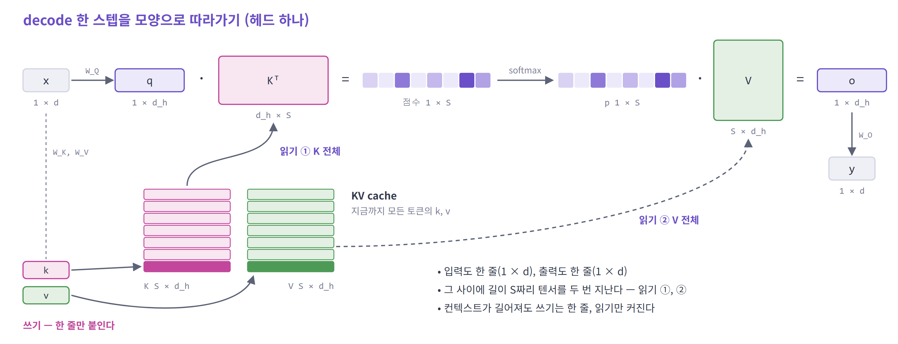

> **입력도 한 줄, 출력도 한 줄이다. 그런데 중간에 길이 `S`짜리 텐서를 두 번 지난다.**

---

### 연산 목록

| 연산 | 식 | shape (헤드 하나) | `S`와의 관계 |
|---|---|---|---|
| Q · K · V projection | `x @ Wq`, `x @ Wk`, `x @ Wv` | `(1 × d)` → `(1 × d_h)` 세 개 | 무관 |
| cache append — **쓰기** | `k`, `v`를 캐시 끝에 붙인다 | `(S−1 × d_h)` → `(S × d_h)` | 무관 — 한 줄만 쓴다 |
| score — **읽기 ①** | `q @ Kᵀ` | `(1 × d_h) × (d_h × S)` → `(1 × S)` | **비례 — K 전체** |
| scale · softmax | `/ √d_h` → softmax | `(1 × S)` 유지 | 비례 — 캐시는 읽지 않는다 |
| weighted sum — **읽기 ②** | `p @ V` | `(1 × S) × (S × d_h)` → `(1 × d_h)` | **비례 — V 전체** |
| output projection | `o @ Wo` | `(1 × d_h)` → `(1 × d)` | 무관 |

- 캐시를 읽는 연산은 **score와 weighted sum 둘**이다. 둘 다 컨텍스트 길이에 비례한다
- projection 네 개는 가중치를 읽는다. 컨텍스트 길이와 무관하다

<details>
<summary>자세히 — 배치와 헤드 축을 넣은 shape</summary>

요청 `B`개, 쿼리 헤드 `n_h`개, KV 헤드 `n_kv`개일 때다.

| 단계 | shape |
|---|---|
| 쿼리 | `(B, n_h, 1, d_h)` |
| 캐시 K, V | `(B, n_kv, S, d_h)` 각각 |
| 읽기 ① 점수 | `(B, n_h, 1, d_h) × (B, n_kv, d_h, S)` → `(B, n_h, 1, S)` |
| 읽기 ② 가중합 | `(B, n_h, 1, S) × (B, n_kv, S, d_h)` → `(B, n_h, 1, d_h)` |

- 캐시의 맨 앞 축이 `B`다. 요청마다 자기 캐시가 따로 있다
- `n_kv`가 `n_h`보다 작으면 KV 헤드 하나를 쿼리 헤드 여러 개가 함께 읽는다 (3.3 GQA)
- 점수에는 `1/√d_h`를 곱하고, softmax는 길이 `S` 방향으로 건다

</details>

---

## 2. KV cache

### 연산에서의 역할

이전 토큰의 `k`, `v`는 한 번 계산하면 바뀌지 않는다. 그래서 저장해 두고 다시 쓴다.

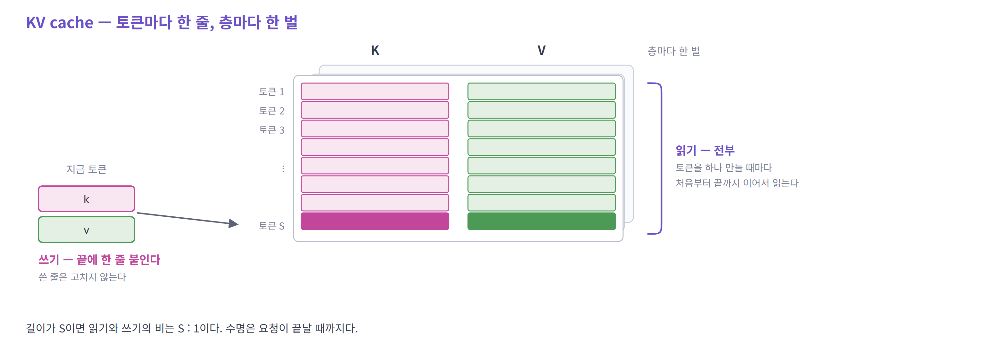

| | 쓰기 | 읽기 |
|---|---|---|
| 언제 | 토큰이 하나 생길 때 | 토큰을 하나 만들 때마다 |
| 얼마나 | **한 줄** (층마다) | **캐시 전체** (층마다) |
| 방식 | 끝에 붙인다. 쓴 것을 고치지 않는다 | 처음부터 끝까지 이어서 읽는다 |

- 길이가 `S`이면 읽기와 쓰기의 비는 **`S` : 1**이다
- 수명은 요청이 끝날 때까지다

---

### 크기

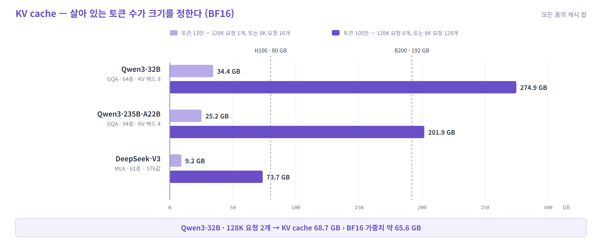

> **Qwen3-32B는 128K 요청 두 개만 동시에 살아 있어도 KV cache가 약 69 GB다. BF16 가중치 약 66 GB보다 크다.**

- 크기를 정하는 것은 요청 수도 길이도 아닌 **살아 있는 토큰의 총합**이다. 128K 요청 8개와 8K 요청 128개는 캐시 크기가 같다
- 점선은 GPU 한 장의 메모리다. 토큰 105만이면 MLA를 쓰는 DeepSeek-V3만 H100 한 장 안에 들어온다
- 메모리만 차지하는 것이 아니다. 토큰을 하나 만들 때마다 그 요청의 캐시를 다시 읽는다. Qwen3-32B의 128K 요청 하나(34.4 GB)는 **토큰마다 약 10 ms**를 읽는 데 쓴다 (H100 대역폭 3.35 TB/s로 나눈 개략값)

<details>
<summary>자세히 — 계산 근거</summary>

각 모델의 공개 `config.json`으로 계산했다. 캐시는 BF16이고, 128K는 131,072토큰이다.

| 모델 | 캐시 구성 | 토큰 하나 | 128K × 1 | 128K × 8 |
|---|---|---:|---:|---:|
| Qwen3-32B | GQA · KV 헤드 8 × 128 · 64층 | 262.1 KB | 34.4 GB | 274.9 GB |
| Qwen3-235B-A22B | GQA · KV 헤드 4 × 128 · 94층 | 192.5 KB | 25.2 GB | 201.9 GB |
| DeepSeek-V3 | MLA · 576 × 61층 | 70.3 KB | 9.2 GB | 73.7 GB |

- GQA: `2 (K,V) × KV 헤드 수 × 헤드 차원 × 층 수 × 2 B`
- MLA: `576 × 61층 × 2 B`
- Qwen3-32B의 BF16 가중치는 `32.8B × 2 B ≈ 65.6 GB`다
- 실제 사용량에는 페이지 단위 할당, 정렬, 프레임워크 오버헤드가 더 붙는다. 캐시 양자화를 쓰면 표보다 작아진다
- 128K는 긴 문서나 에이전트 작업처럼 컨텍스트를 한도까지 쓰는 경우다. 두 Qwen3 모델은 설정 파일의 기본 최대 길이가 40,960이고, 128K는 확장 설정이다

</details>

---

### 문제

**1. 컨텍스트 길이에 비례한다.** 저장량도, 토큰 하나를 만들 때 읽는 양도 `S`에 비례한다.

**2. 요청마다 따로 든다.** 배치를 키우면 가중치는 한 번 읽어 여러 요청에 쓰지만, KV cache는 요청마다 내용이 달라 **배치를 키운 만큼 그대로 늘어난다.**

| | 가중치 | KV cache |
|---|---|---|
| 내용 | 모델 | 그 요청의 대화 기록 |
| 요청이 `B`개일 때 읽는 양 | 그대로 — 한 번 읽어 `B`개에 쓴다 | **`B`배** |
| 크기를 정하는 것 | 모델 크기 | 동시에 살아 있는 요청들의 **토큰 총합** |

---

### 줄이는 세 방향

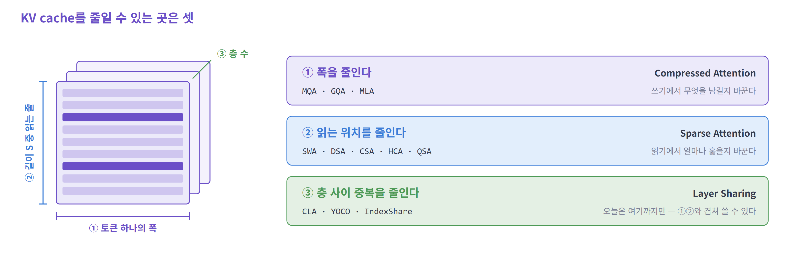

- ①은 **쓰기**(무엇을 남길지)를, ②는 **읽기**(얼마나 훑을지)를 바꾼다
- 아래 3번은 ①을, 4번은 ②를 따라간다
- ③은 ①②와 겹쳐 쓸 수 있다 — 여러 층이 KV나 선택 결과를 나눠 쓴다. 이 자료에서는 다루지 않는다

---

### 모델별 채택 현황

| 공개 | 모델 | 저장 | 읽기 |
|---|---|---|---|
| 2024-12 | DeepSeek-V3 | MLA | 전부 |
| 2025-04 | Qwen3-235B | GQA (쿼리 64 / KV 4) | 전부 |
| 2025-07 | Kimi K2 | MLA | 전부 |
| 2025-08 | gpt-oss-120b | GQA (64 / 8) | 최근 128개만 읽는 층과 전부 읽는 층을 1:1 |
| 2025-12 | DeepSeek-V3.2 | MLA | **DSA** (상위 2,048) |
| 2026-02 | GLM-5 | MLA | **DSA** (상위 2,048) |
| 2026-04 | DeepSeek-V4 | 512차원 엔트리 하나 (K = V) | **CSA / HCA** 교대 |
| 2026-04 | Gemma 4 31B | GQA (32 / 16) | 최근 1,024개만 읽는 층 5 : 전부 읽는 층 1 |
| 2026-06 | Kimi K3 | 4층 중 1층만 MLA, 나머지는 선형 attention | 전부 |
| 2026-06 | MiniMax M3 | GQA (64 / 4) | 128토큰 블록 단위로 고른다 (상위 16블록) |
| 2026-08 | Qwen3.8-2.4T | 4층 중 1층만 GQA, 나머지는 선형 attention | 전부 |
| 2026-08 | Qwen3.8-Flash-Next | 4층 중 1층만 GQA, 나머지는 선형 attention | **QSA** (상위 512블록) |
| 2026-08 | GLM-5.3 | MLA | **DSA** + 고른 결과를 여러 층이 공유 |
| 2026-09 | DeepSeek-V4.1-Flash | 512차원 엔트리 하나 (K = V) | V4 계열. 색인을 40층 중 8층에서만 계산 |

저장과 읽기는 각 모델의 `config.json`에서 읽었다. 공개 시점은 2026-04의 DeepSeek-V4와 2026-06 이후 모델의 경우 Hugging Face 저장소가 만들어진 달이라, 실제 발표와 조금 다를 수 있다.

> **2026년에 나온 대형 공개 모델 가운데 "토큰마다 K, V를 남기고 전부 읽는" 것은 드물다.**
> 읽는 양을 줄이거나(DSA · CSA/HCA · QSA · 블록 선택), 캐시를 두는 층 자체를 줄인다(선형 attention과 혼합).

---

### 기법의 계보

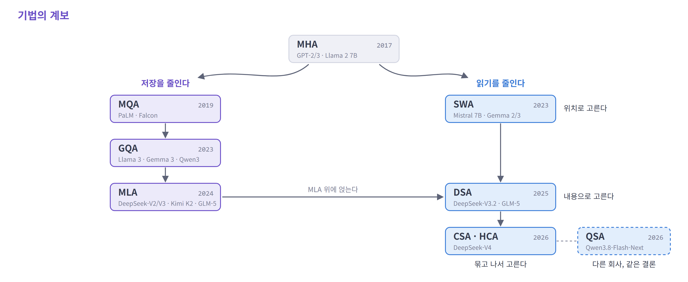

---

## 3. 저장을 줄인다 — MHA · MQA · GQA · MLA

계보의 왼쪽 가지다. **쓰기에서 무엇을 남길지**를 바꾼다.

| 기법 | 캐시에 남기는 것 | 읽는 범위 |
|---|---|---|
| MHA | 헤드마다 K, V | 전부 |
| MQA | K, V 하나 | 전부 |
| GQA | 그룹마다 K, V | 전부 |
| MLA | latent 하나 + RoPE 조각 | 전부 |

- 네 기법 모두 **컨텍스트 전체를 이어서 읽는다.** 달라지는 것은 토큰 하나가 캐시에 남기는 양이다
- 연산은 처음부터 끝까지 행렬 × 벡터뿐이다

---

출발점은 2017년의 MHA다. 당시의 관심사는 메모리가 아니었다.
attention 한 번으로는 **한 가지 관계밖에 못 본다**는 것이 문제였고, 그래서 헤드를 여러 개 뒀다.

---

### 3.1 MHA — 기준점

*Multi-Head Attention*

> **MHA** · 2017 · Google (Transformer 원 논문)
> GPT-2 / 3 · Llama 1 · Llama 2 7B — **2023년 이전의 사실상 전부**

**헤드를 늘리면 무엇이 늘어나나?**

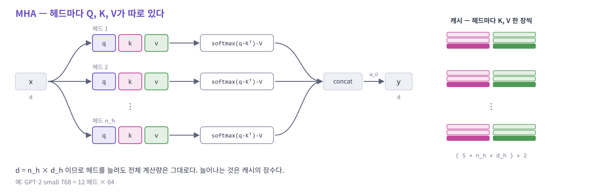

- `d = n_h × d_h`이므로 헤드를 늘려도 **전체 연산량은 attention 한 번과 같다**
- 그런데 캐시는 **헤드 수만큼** 장수가 늘어난다
- 원 논문에는 KV cache라는 개념이 없었다 — 캐시를 염두에 둔 설계가 아니다

---

MHA의 캐시는 헤드 수에 정비례한다. 헤드가 64개면 캐시도 64장이다.

여기서 물을 수 있다. 쿼리는 헤드마다 달라야 하지만, **K와 V도 정말 헤드마다 달라야 하나?**

2019년 Shazeer의 답은 과감했다. **하나면 충분하다.**

---

### 3.2 MQA — KV 헤드 하나

*Multi-Query Attention*

> **MQA** · 2019 · Google
> PaLM · Falcon · StarCoder — 대형 모델에서는 **곧 GQA로 대체됨**

쿼리 헤드는 그대로 두고, **K와 V는 헤드 하나 분량만** 만든다. 모든 쿼리 헤드가 그 하나를 함께 읽는다.

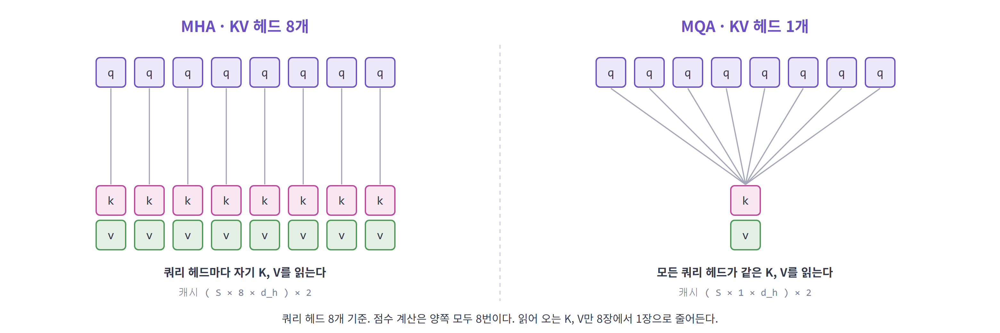

- 선(점수 계산)의 수는 그대로다. **선이 가리키는 대상만** 줄어든다
- 헤드가 64개인 모델이면 캐시가 `( S × 64 × d_h )`에서 `( S × 1 × d_h )`로 — **1/64**
- 한계: 모든 헤드가 같은 K, V를 본다 — **품질 저하가 뚜렷했다**

---

MQA는 효과가 확실했다. 그런데 큰 모델에 적용하자 **품질이 문제가 됐다.**
볼 수 있는 K와 V가 하나뿐이면 헤드를 여럿 둔 의미가 사라진다.

방향은 맞았는데 너무 많이 갔다. **전부 공유와 공유 안 함 사이를 고를 수 있으면 된다.**

---

### 3.3 GQA — KV 헤드를 그룹으로

*Grouped-Query Attention*

> **GQA** · 2023 · Google
> Llama 3 · Gemma 3 · **Qwen3** · gpt-oss — **지금의 사실상 표준**

쿼리 헤드를 몇 개씩 묶고, 묶음 하나가 KV 헤드 하나를 함께 쓴다.

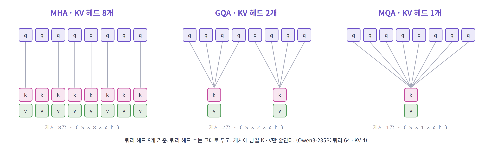

- 새 메커니즘이 아니라 **MHA와 MQA를 양 끝으로 하는 눈금**이다 (Qwen3-235B: 쿼리 64 / KV 4)
- 쿼리 헤드 수와 출력은 그대로다. 줄어드는 것은 **K·V를 만드는 일, 저장량, 읽는 양**이다
- 기존 MHA 체크포인트를 소량의 추가 학습으로 전환할 수 있었다 — 빠르게 퍼진 이유

#### 시스템 동작에서 달라지는 것

- 쿼리 헤드 여러 개가 KV 헤드 하나를 **함께 읽는다.** 곱셈 횟수는 그대로이고, 메모리에서 읽어 오는 양만 그룹 크기만큼 줄어든다
- 단, **K와 V를 쿼리 헤드 수에 맞춰 복사해 놓고 읽으면 안 된다.** 복사하면 읽는 양이 MHA와 같아진다. 줄어드는 것은 저장량뿐이고, 속도는 그대로다
- 그래서 커널은 복사하지 않는다. 쿼리 헤드가 **자기 그룹의 KV 헤드를 직접 가리켜** 읽게 한다. GQA의 속도 이득은 여기서 나온다

<details>
<summary>자세히 — 읽은 바이트당 연산은 어떻게 센 것인가</summary>

점수 계산에서 K 한 줄을 읽을 때를 센다 (BF16, 값 하나 2바이트).

| | 읽는 양 | 그 값으로 하는 연산 | 바이트당 |
|---|---|---|---|
| MHA | 헤드 하나의 K 한 줄 — `2·d_h` B | 내적 한 번 — `2·d_h` FLOP | 약 1 |
| GQA | KV 헤드 하나의 K 한 줄 — `2·d_h` B | 쿼리 헤드 `g`개의 내적 — `g·2·d_h` FLOP | 약 `g` |
| MLA | latent 한 줄 — 1,152 B | 쿼리 헤드 128개의 내적 — 128 × 1,152 FLOP | 약 128 (섞기까지 넣으면 최대 약 240) |

- 가중합(V 쪽)도 같은 비율이다
- 비교 기준: H100은 바이트 하나를 읽는 동안 약 295 FLOP을 할 수 있다 (BF16 989 TFLOPS ÷ 3.35 TB/s)

</details>

#### 저장량 비교

토큰 하나가 층 하나에 남기는 양 (쿼리 헤드 128개, `d_h` 128, BF16 기준)

| | MHA | GQA (`n_kv`=8) | MQA |
|---|---|---|---|
| 값의 개수 | 32,768 | 2,048 | 256 |
| 바이트 | 64 KiB | 4 KiB | 512 B |

---

GQA는 좋은 타협이지만 **상수배 절감**이 한계다. 그룹을 키울수록 MQA의 품질 문제로 되돌아간다.

DeepSeek가 던진 질문은 달랐다. 헤드끼리 나눠 갖는 대신, **저장하는 값 자체를 작게 만들 수는 없나?**

눌러 담았다가 쓸 때 펴면 되지만, 펴는 연산이 붙으면 오히려 느려진다.
MLA의 진짜 기여는 **그 펴는 연산을 없앤 것**이다.

---

### 3.4 MLA — 저장하는 값 자체를 압축한다

*Multi-head Latent Attention*

> **MLA** · 2024 · DeepSeek
> DeepSeek-V2 / V3 / R1 · Kimi K2 · GLM-5 — **긴 컨텍스트를 노리는 대형 모델에서 채택 확대 중**

MLA에는 아이디어가 둘 있다. **작게 저장하는 것**, 그리고 **다시 펴지 않는 것**이다.

#### 무엇을 저장하나

지금까지는 입력 `x`에서 K와 V를 바로 만들어 그대로 저장했다. MLA는 그 사이에 한 단계를 끼운다.

1. `x`를 **작은 벡터 하나**(`c_KV`, 512차원)로 눌러 담는다
2. 캐시에는 **그 벡터만** 저장한다
3. K와 V는 그 벡터에 행렬을 곱한 것으로 **정의**된다 (`K = c · W^UK`, `V = c · W^UV`)

K와 V를 따로 저장하던 것이 벡터 하나로 합쳐진다. 아래 그림의 점선 상자가 캐시에 남는 전부다.
정의는 이렇지만 **실제 decode에서는 K와 V를 만들지 않는다.** 그 방법이 바로 뒤에 나온다.

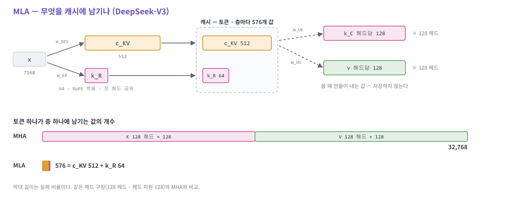

| | 캐시에 남기는 것 | 토큰·층당 값 |
|---|---|---|
| MHA / GQA | 완성된 K와 V | 32,768 (MHA, 헤드 128개) |
| **MLA** | K와 V를 만들 수 있는 **재료** — `c_KV` 512 + `k_R` 64 | **576** |

`k_R`은 위치 정보(RoPE) 때문에 따로 남겨야 하는 64차원 조각이다. 왜 따로 두는지는 해법을 본 직후에 나온다.

---

#### 그런데 쓸 때마다 펴야 한다

점수를 내려면 `q · Kᵀ`를 계산해야 한다. 그런데 캐시에 K가 없다. 있는 것은 `c_KV`뿐이다.

```
캐시의 c_KV  ──  × W^UK  ──►  K 복원  ──►  q · Kᵀ
```

- 컨텍스트가 4,096이면 **4,096줄을 전부** K로 펴야 한다. V도 마찬가지다
- 한 번이 아니다. **토큰을 하나 만들 때마다** 되풀이한다
- 곱셈만 드는 것이 아니다. **편 결과를 메모리에 썼다가 다시 읽는다** — 4,096줄이면 층 하나에 약 268 MB다
- 편 결과를 캐시해 두면? → 캐시가 MHA 크기로 돌아간다

> **작게 저장해도 쓸 때마다 펴면 남는 것이 없다.**

---

#### 해법 — 캐시를 펴지 않고, 쿼리를 옮긴다

캐시를 K로 펴는 것이 아니라, **쿼리를 캐시에 맞게 바꾼다.**
원래의 점수 `q · kᵀ`에 `k = c · W^UK`를 넣고 곱하는 순서만 바꾸면 된다. 값은 그대로다.

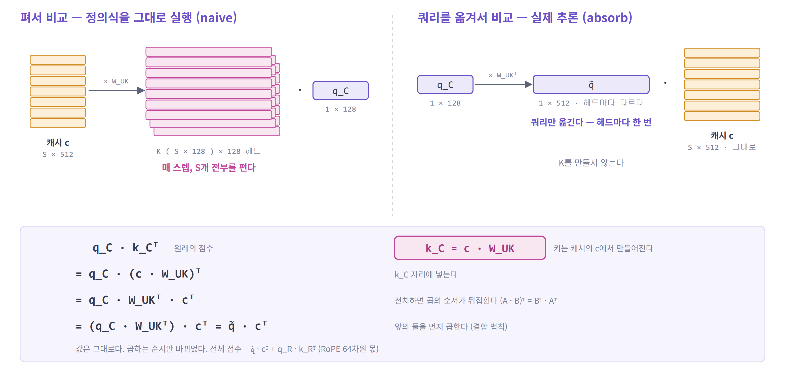

**점수는 양쪽 모두 `S`번 낸다. 달라지는 것은 그 앞에서 하는 변환이다.**

| | 펴서 비교 | 쿼리를 옮겨서 비교 |
|---|---|---|
| ① 변환 | `c₁ → k₁`, `c₂ → k₂`, … , `c_S → k_S` | `q → q̃` |
| | 캐시를 한 줄씩 전부 — **`S`번** | 쿼리 하나만 — **1번** |
| ② 점수 | `q · k₁`, `q · k₂`, … , `q · k_S` | `q̃ · c₁`, `q̃ · c₂`, … , `q̃ · c_S` |
| | 펴 놓은 K와 곱한다 | **캐시를 그대로** 곱한다 |

횟수는 헤드 하나 기준이다. 이 일을 토큰을 하나 만들 때마다, 층마다 되풀이한다.

**그래서 무엇을 얻나**

- **캐시를 펴는 곱셈이 통째로 사라진다.** `S`줄을 바꾸던 일이 쿼리 한 줄을 바꾸는 일로 줄어든다
- DeepSeek-V3, `S` = 4,096이면 층 하나에서 약 **69G번 → 약 0.017G번**이다
- 펴지 않으니 **편 결과를 둘 곳도 필요 없다.** 펴는 쪽은 K, V를 메모리에 썼다가 다시 읽어야 한다 (같은 조건에서 약 268 MB)
- 펴는 비용은 컨텍스트 길이에 비례한다. **길수록 차이가 벌어진다**

> **작게 저장해도 쓸 때마다 펴면 남는 것이 없었다. 펴지 않으니, 저장할 때 줄인 것이 읽을 때도 그대로 줄어 있다.**

<details>
<summary>자세히 — 위 숫자의 계산</summary>

DeepSeek-V3: 헤드 128, `c_KV` 512, 헤드당 K 128 · V 128. `S` = 4,096.

| | 계산 | 값 |
|---|---|---|
| 펴는 곱셈 | 토큰 하나를 펴는 데 512 × 128헤드 × (128 + 128) = 16.8M. 여기에 × 4,096 | 약 69G |
| 옮기는 곱셈 | 쿼리 쪽 128헤드 × 128 × 512 = 8.4M, 출력 쪽 128헤드 × 512 × 128 = 8.4M | 약 0.017G |
| 편 K, V의 크기 | 4,096 × 128헤드 × 256 × 2 B | 약 268 MB |

- K와 V를 펴는 것, 쿼리를 옮기고 결과를 펴는 것을 합친 값이다. V 쪽은 뒤의 "값(V)도 펴지 않는다"에서 본다

</details>

<details>
<summary>자세히 — 유도 과정</summary>

```
q_C · k_Cᵀ                                   k_C = c_KV · W^UK
  = q_C · (c_KV · W^UK)ᵀ                     k_C 자리에 넣는다
  = q_C · W^UKᵀ · c_KVᵀ                      전치하면 곱의 순서가 뒤집힌다  (A·B)ᵀ = Bᵀ·Aᵀ
  = (q_C · W^UKᵀ) · c_KVᵀ  =  q̃ · c_KVᵀ      앞의 둘을 먼저 곱한다 (결합 법칙)
```

- 쓰인 규칙은 둘뿐이다. 전치의 성질과 행렬곱의 결합 법칙
- 근사가 아니다. 둘째 줄과 넷째 줄은 정확히 같은 값이다
- `q̃ = q_C · W^UKᵀ` — 헤드의 질문을 latent 좌표계(512차원)로 옮겨 적은 것이다

</details>

---

#### 위치 정보는 따로 둔다

곱하는 순서를 바꿀 수 있었던 것은 `W^UK`와 `c` 사이에 **다른 연산이 끼어 있지 않기 때문**이다.

그런데 위치 정보(RoPE)는 키에 **토큰 위치마다 다른 회전**을 건다. 이 회전이 사이에 끼면 `W^UK`를 쿼리 쪽으로 넘길 수 없다.

그래서 키를 두 조각으로 나눈다.

| 조각 | 차원 | 위치 정보 | 헤드별인가 | 캐시에는 |
|---|---|---|---|---|
| 내용부 `k_C` | 헤드당 128 | 없다 | 헤드마다 다르다 | `c_KV`로 대신한다 — **옮길 수 있다** |
| 위치부 `k_R` | 64 | RoPE를 건다 | **전 헤드 공유** | 그대로 저장한다 |

점수도 두 부분의 합이 된다.
키는 두 조각을 **이어 붙인** 벡터 `[k_C ; k_R]`이고 쿼리도 `[q_C ; q_R]`이다. 이어 붙인 벡터끼리의 내적은 **조각끼리 내적한 것을 더한 값**과 같다.
그래서 실제로는 이어 붙이지 않는다. 내용 쪽 곱과 위치 쪽 곱을 **따로 계산해** `(128 × S)` 두 장을 얻고, 같은 자리끼리 더한다.

```
 점수   =   q̃ · c_KVᵀ      +      q_R · k_Rᵀ
            └ 내용 점수 ┘          └ 위치 점수 ┘
                        ↓
                     softmax
```

- 캐시에 `k_R` 64차원이 더 붙는 이유다 — 512 + 64 = **576**
- `k_R`은 전 헤드가 공유하고, 쿼리 쪽 `q_R`은 헤드마다 다르다. **저장하는 쪽은 공유하고, 묻는 쪽만 헤드마다 다르게** 둔 것이다

---

#### 값(V)도 펴지 않는다

attention의 출력은 `p · V`다. V도 `c_KV`에서 만들어지므로 (`V = c · W^UV`) 같은 방법을 쓴다.

```
p · (c · W^UV)   =   (p · c) · W^UV
└ S줄을 편 뒤 섞는다 ┘   └ 먼저 섞고, 결과 한 줄만 편다 ┘
```

| | 펴는 대신 |
|---|---|
| K 쪽 | 캐시 `S`줄을 변환하지 않고 **쿼리 한 줄**을 변환한다 |
| V 쪽 | 캐시 `S`줄을 변환하지 않고 **섞은 결과 한 줄**을 변환한다 |

---

#### 헤드마다 다르게 본다

캐시는 전 헤드가 함께 쓰는 하나뿐이다. 그런데도 헤드별 표현력이 남는 이유가 있다.

- 쿼리를 옮기는 행렬 `W^UK`가 **헤드마다 다르다.** 그래서 옮긴 쿼리 `q̃`도 헤드마다 다르다
- 같은 `c_KV`를 읽어도 **헤드마다 다른 방향에서** 본다
- 위치 쪽 쿼리 `q_R`도 헤드마다 따로 있다

> **읽는 방식은 MQA와 같고, 표현하는 방식은 MHA에 가깝다.**
> K, V를 그대로 공유하는 MQA보다 헤드별 차이를 더 남기도록 설계한 것이다. MHA와 똑같다는 뜻은 아니다.

---

#### 전체 흐름

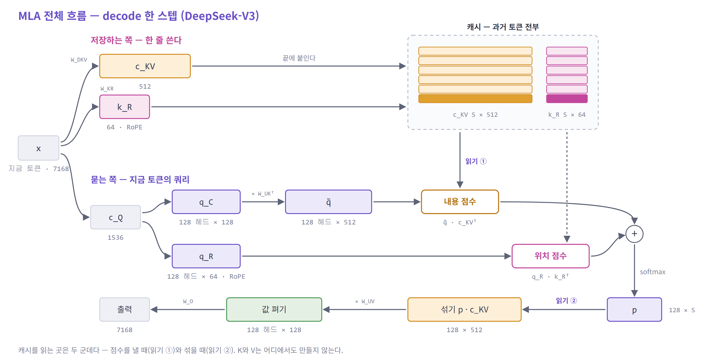

- **K와 V가 그림 어디에도 없다.** 캐시에서 나온 `c_KV`가 그대로 점수와 섞기에 들어간다
- **변환은 지금 토큰 쪽에서만 일어난다** — 쿼리를 옮길 때(`W^UKᵀ`)와 결과를 펼 때(`W^UV`). 캐시 쪽에는 변환이 없다
- **캐시에 닿는 것은 세 번이다** — 끝에 한 줄 쓰기, 점수를 낼 때 읽기, 섞을 때 읽기

---

#### 텐서 연산으로 보면

DeepSeek-V3의 decode 한 스텝, 층 하나다 (헤드 128개).

| # | 연산 | 식 | shape | 종류 |
|---|---|---|---|---|
| 1 | KV 압축 | `x · W^DKV` → `c_KV`, `x · W^KR` → `k_R` | `(1 × 7168)` → `(1 × 512)`, `(1 × 64)` | 행렬 × 벡터 |
| 2 | 캐시에 붙이기 | `c_KV`, `k_R`을 끝에 붙인다 | `(S × 512)`, `(S × 64)`에 한 줄 | 메모리 쓰기 |
| 3 | 쿼리 만들기 | `x` → `c_Q` → `q_C`, `q_R` | `(1 × 7168)` → `(1 × 1536)` → `(128 × 128)`, `(128 × 64)` | 행렬 × 벡터 두 번 |
| 4 | 쿼리 옮기기 | `q̃ = q_C · W^UKᵀ` | 헤드마다 `(1 × 128) × (128 × 512)` → `(128 × 512)` | 헤드별 행렬 × 벡터 |
| 5 | **내용 점수** | `q̃ · c_KVᵀ` | `(128 × 512) × (512 × S)` → `(128 × S)` | **행렬 × 행렬** |
| 6 | **위치 점수** | `q_R · k_Rᵀ` | `(128 × 64) × (64 × S)` → `(128 × S)` | **행렬 × 행렬** |
| 7 | 더하고 softmax | `p = softmax(5 + 6)` | `(128 × S)` 유지 | 원소별 연산 |
| 8 | **섞기** | `p · c_KV` | `(128 × S) × (S × 512)` → `(128 × 512)` | **행렬 × 행렬** |
| 9 | 값 펴기 | `(p · c_KV) · W^UV` | 헤드마다 `(1 × 512) × (512 × 128)` → `(128 × 128)` | 헤드별 행렬 × 벡터 |
| 10 | 출력 | `o · W^O` | `(1 × 16384) × (16384 × 7168)` → `(1 × 7168)` | 행렬 × 벡터 |

- **5 · 6 · 8번이 캐시를 읽는다.** `S`에 비례하는 것은 이 셋뿐이다
- MHA에서는 헤드마다 자기 K가 따로 있어, 이 자리가 헤드 수만큼의 **행렬 × 벡터**였다
- MLA에서는 헤드 128개가 **같은 캐시**를 읽는다. 쿼리 128줄을 한 행렬로 쌓으면 **행렬 × 행렬 한 번**이 된다
- 캐시 한 줄을 읽어 128번 쓰는 셈이다. 읽은 값을 여러 번 쓰는 연산으로 바뀐 것이다
- `c_KV`는 5번과 8번에서 **두 번** 쓰인다. MHA에서 K와 V가 따로 하던 일을 벡터 하나가 겸한다

<details>
<summary>자세히 — 쿼리도 압축한다 (Q compression)</summary>

쿼리도 `x`에서 바로 만들지 않고 중간 벡터를 거친다 (위 표의 3번).

```
x (7168)  ──►  c_Q (1536)  ──┬──►  q_C  헤드당 128     내용부
                             └──►  q_R  헤드당 64      위치부, RoPE를 건다
```

- **목적이 KV 압축과 다르다.** 쿼리는 지금 토큰 것 하나만 필요하고, 다음 토큰으로 넘어가면 버린다. 캐시하지 않는다
- 그래서 쿼리 압축은 캐시를 줄이지 않는다. 줄어드는 것은 쿼리를 만드는 가중치의 크기다
- `q_R`은 헤드마다 따로 만든다. 캐시하지 않으니 헤드마다 달라도 저장량이 늘지 않는다
- 정리하면 — KV 압축은 **캐시를 줄이려는 것**, Q 압축은 **가중치를 줄이려는 것**이다

</details>

<details>
<summary>자세히 — prefill에서는</summary>

- 프롬프트의 토큰 `T`개가 한꺼번에 들어온다. 쿼리가 `(128 × T × 512)`가 되어 점수는 `(128 × T × S)`다
- 이때는 연산이 병목이라, 읽는 양을 줄이는 이득이 decode만큼 크지 않다
- DeepSeek-V3.2 공개 코드는 prefill에서는 K와 V를 펴서 계산하고, decode에서만 쿼리를 옮기는 방식을 쓴다

</details>

---

#### 줄어든 것과 늘어난 것

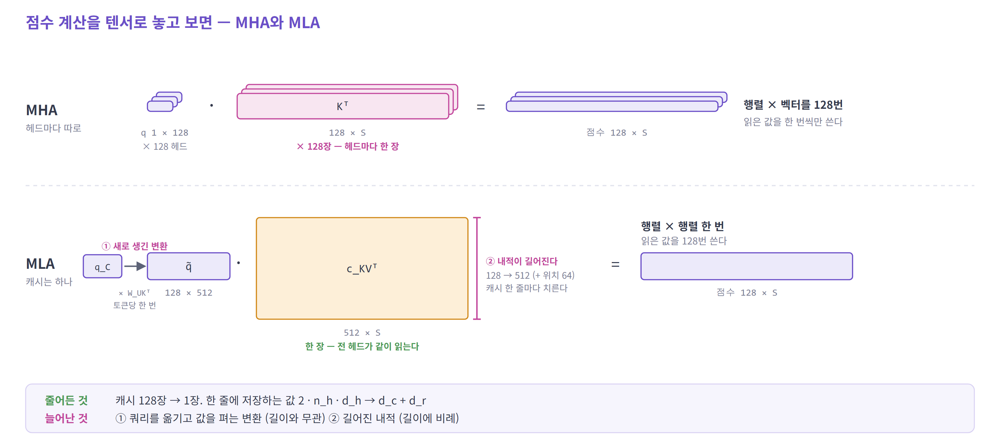

- **줄어든 것** — 캐시가 헤드마다 한 장에서 **전체 한 장**으로. 읽어 올 것이 그만큼 줄어든다
- **늘어난 것 ①** — 쿼리를 옮기고 값을 펴는 변환이 새로 생긴다. 토큰당 한 번이라 길이와 무관하다
- **늘어난 것 ②** — 내적이 128차원에서 512차원(+ 위치 64)으로 길어진다. 캐시 한 줄마다 치르므로 **길이에 비례한다**
- 내적을 하는 **횟수는 MHA와 같다** (캐시 한 줄에 헤드마다 한 번). 내적 하나가 길어져서, 점수와 섞기에 드는 **전체 연산량이 MHA의 약 4배**가 된다
- 연산의 모양도 바뀐다. 헤드 수만큼의 행렬 × 벡터가 **행렬 × 행렬 한 번**이 된다 — 읽은 값을 128번 쓴다

> **읽는 양을 줄이고, 곱하는 양으로 지불했다.**

<details>
<summary>자세히 — 기호와 숫자로 보면</summary>

캐시 한 줄(토큰 하나, 층 하나)을 처리할 때다.
`n_h` 헤드 수 · `d_h` 헤드 차원 · `d_c` latent 차원 · `d_r` 위치 조각의 차원

| | MHA | MLA |
|---|---|---|
| 캐시에 저장된 값 | `2 · n_h · d_h` | `d_c + d_r` |
| 점수 · 섞기에서 읽는 값 | `2 · n_h · d_h` | `d_c + d_r` ~ `2·d_c + d_r` |
| 곱셈 (점수 + 섞기) | `2 · n_h · d_h` | `n_h · (2·d_c + d_r)` |
| 읽은 값 하나로 하는 곱셈 | 1번 | `n_h`번 ~ `2·n_h`번 |

- MHA는 저장도 읽기도 곱셈도 전부 `n_h · d_h`에 비례한다. **읽은 값 하나를 한 번 쓰고 끝난다**
- MLA의 저장에는 **`n_h`가 없다.** 헤드를 늘려도 캐시가 커지지 않는다
- 대신 곱셈에 `n_h`와 `d_c`가 함께 붙는다. **읽은 값 하나를 헤드 수만큼 다시 쓴다**
- 읽는 값에 범위가 있는 이유 — `c_KV`는 점수에서 한 번, 섞기에서 한 번 쓰인다. 커널이 한 번 읽어 두 번 쓰면 `d_c + d_r`, 따로 읽으면 `2·d_c + d_r`이다

DeepSeek-V3의 값을 넣으면 (`n_h` 128 · `d_h` 128 · `d_c` 512 · `d_r` 64)

| | MHA | MLA | |
|---|---|---|---|
| 저장 | 32,768 | **576** | 약 1/57 |
| 읽기 | 32,768 | **576 ~ 1,088** | 1/57 ~ 1/30 |
| 곱셈 | 32,768 | **139,264** | 약 4배 |

**식이 나오는 과정**

| | 식 | 어디서 나오나 |
|---|---|---|
| MHA 저장 · 읽기 | `2 · n_h · d_h` | 헤드마다 K `d_h`개와 V `d_h`개 |
| MHA 곱셈 | `2 · n_h · d_h` | 점수 `n_h · d_h` + 섞기 `n_h · d_h` |
| MLA 저장 | `d_c + d_r` | `c_KV`와 `k_R` 한 줄씩. 헤드와 무관하다 |
| MLA 읽기 | `d_c + d_r` ~ `2·d_c + d_r` | 점수에서 `c_KV`와 `k_R`, 섞기에서 `c_KV`를 다시 |
| MLA 곱셈 | `n_h · (2·d_c + d_r)` | 점수 `n_h · (d_c + d_r)` + 섞기 `n_h · d_c` |

읽은 바이트당 연산 (곱셈·덧셈 한 쌍을 2 FLOP, 값 하나를 2바이트로 센다)

| | 값 |
|---|---|
| MHA | 약 1 |
| MLA | 약 130 ~ 240 — 위 표의 `n_h`번 ~ `2·n_h`번에 해당한다 |
| GPU가 낼 수 있는 값 | 약 300 (H100: 연산 성능 ÷ 메모리 대역폭) |

</details>

---

#### 시스템 동작에서 달라지는 것

- **읽은 값을 헤드 수만큼 다시 쓴다.** 읽기에 묶여 있던 일이 연산 쪽으로 옮겨 간다. 읽기를 기다리느라 연산기가 놀던 decode에 맞는 방향이다
- **중간 결과를 메모리에 쓰지 않는다.** 펴는 방식은 매 스텝 268 MB를 만들어 쓰고 다시 읽는다
- **곱하는 순서가 성능을 정한다.** 같은 가중치인데 순서에 따라 메모리 이동량이 수천 배 달라진다. 정의식을 그대로 실행하면 펴는 방식이 되므로 **전용 커널**이 필요하다

---

#### 한 문장으로 줄이면

> **KV cache를 latent representation으로 압축하고, 선형대수의 결합 법칙으로 K/V 복원을 attention의 반대쪽으로 흡수해, memory traffic을 compute로 교환하는 attention 구조**

> **토큰 하나는 얇아졌다. 그런데 읽는 토큰 수는 여전히 `S` 전부다.**

---

### 짚어 둘 점

**MLA가 유리한 조건**

- **decode가 읽기에 묶여 있을 때**다. 연산이 병목인 prefill이나 짧은 컨텍스트에서는 이득이 줄어든다
- **커널이 `c_KV`를 한 번 읽어 점수와 섞기에 다시 쓸 때**다
- 길다고 항상 유리한 것은 아니다. 늘어난 곱셈 가운데 길어진 내적은 길이에 비례한다

**GQA가 여전히 표준인 이유**

- 표준 커널로 돌고, 구현이 단순하고, 기존 MHA 모델을 조금 더 학습시켜 바꿀 수 있다
- MLA는 이 세 가지가 모두 반대다

---

## 4. 읽기를 줄인다 — SWA · DSA · CSA/HCA · QSA

여기서 발상이 한 번 바뀐다.

3번은 전부 **무엇을 저장할 것인가**의 문제였다. 무엇을 남기든, 남긴 것은 **전부 읽었다.**

그런데 정말 전부 읽어야 하나? 지금 만들 토큰과 관련 있는 것은 그중 일부다.
계보의 오른쪽 가지는 **읽기에서 얼마나 훑을지**를 바꾼다.

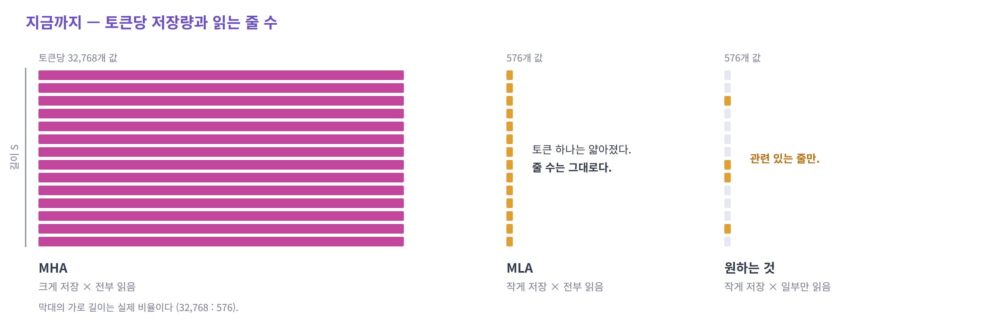

| 기법 | 무엇으로 고르나 | 본 attention이 읽는 것 | 접근 |
|---|---|---|---|
| SWA | 위치 (최근 `W`개) | `W`줄 | 이어서 |
| DSA | 내용 (값싼 indexer) | 고른 `k`줄 | 흩어져서 |
| CSA | 내용, 4개씩 묶은 뒤 | 고른 엔트리 | 흩어져서 |
| HCA | 고르지 않는다, 128개씩 묶는다 | 묶은 결과 전부 | 이어서 |
| QSA | 내용, 4토큰 블록 단위 | 고른 블록 | 블록 단위로 |

- 3번의 기법들은 토큰당 저장량을 줄였다. 여기서는 **읽는 줄의 수**를 줄인다
- 여기서부터 **행렬곱이 아닌 연산**과 **이어지지 않는 읽기**가 등장한다

---

가장 단순한 답부터 본다. 다음 단어의 단서는 대부분 바로 앞에 있다. 그러니 **최근 것만 읽는다.**

---

### 4.1 SWA — 최근 것만 읽는다

*Sliding Window Attention*

> **SWA** · 2023 · Mistral
> Mistral 7B (`W` = 4,096) · Gemma 2 / 3 (지역 층 5 : 전역 층 1) · gpt-oss (`W` = 128, 1 : 1)

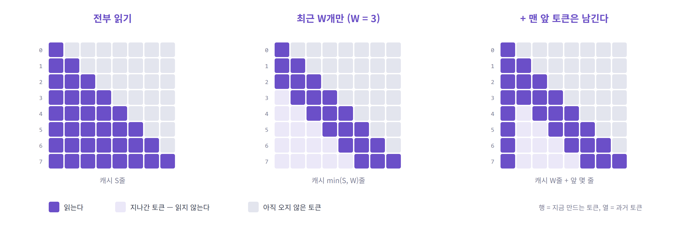

- **캐시가 컨텍스트 길이에 비례하지 않는 첫 방법** — 1M이어도 `W`에서 멈춘다
- 한계: **윈도우 밖은 직접 볼 수 없다.** 그래서 몇 개 층은 전부 읽는 층으로 남긴다
- 맨 앞 토큰 몇 개는 예외로 남겨두기도 한다 — 버리면 품질이 무너지는 경우가 있다

#### 정리

- **고르는 비용이 없다** — 규칙이 고정이고, 읽는 구간이 이어져 있다
- **버리는 일이 처음 생긴다** — 새 줄을 쓰면 가장 오래된 줄이 나간다. 요청 하나의 캐시가 고정 크기가 된다

---

SWA의 한계는 **고정된 규칙**이라는 점이다. 답이 문서 앞쪽에 있으면 찾지 못한다.

그러면 **어디를 볼지 모델이 고르게** 하면 된다. 다만 함정이 둘 있다.
**고르는 일이 비싸면** 아낀 것이 사라지고, **고른 위치가 흩어지면** 메모리를 여기저기서 긁어와야 한다.

DeepSeek-V3.2의 답은 가벼웠다. MLA 앞에 **값싸게 후보를 찾는 단계 하나**를 덧붙인다.

---

### 4.2 DSA — 싸게 찾고, 비싸게 본다

*DeepSeek Sparse Attention*

> **DSA** · 2025 · DeepSeek
> DeepSeek-V3.2 · GLM-5 / 5.2 / 5.3
> (GLM-5.2부터는 고른 결과를 4개 층이 나눠 쓴다 — Layer Sharing의 실제 사례)

MLA가 줄인 것은 **캐시 한 줄의 크기**다. 토큰 하나가 남기는 값이 32,768개에서 576개가 됐다.

**읽는 줄 수는 그대로다.** 컨텍스트가 100만 토큰이면 캐시도 100만 줄이고, 토큰을 하나 만들 때마다 전부 읽는다.

지금 만들 토큰과 관련 있는 줄은 그중 일부다. **관련 있는 2,048줄만 읽으면** 되지 않을까?

#### 그 2,048줄을 어떻게 찾나?

가장 정확한 방법은 attention 점수를 전부 내 보고 높은 줄을 고르는 것이다.
그런데 그러려면 **100만 줄을 다 읽고 다 곱해야** 한다. 고르기도 전에 비싼 계산이 끝나 있다.

> **고르는 일이 비싸면, 골라서 아낀 것이 사라진다.**

---

#### 해법 — MLA 앞에 indexer를 둔다

MLA는 그대로 두고, 그 **앞에 단계 하나를 추가**한다. 이 단계를 맡는 것이 **lightning indexer**다.

1. **indexer** (추가된 단계) — 100만 줄 전부에 값싸게 점수를 매겨, 큰 것 2,048줄의 **위치**를 뽑는다
2. **MLA attention** (원래 하던 일) — 그 2,048줄에 대해서만 계산한다

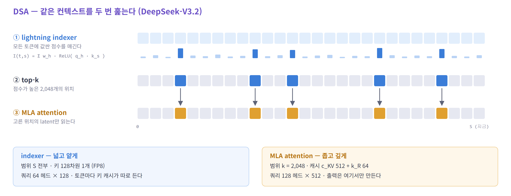

- indexer가 넘기는 것은 **위치뿐**이다. 출력은 MLA가 만든다
- MLA의 캐시와 계산은 바뀌지 않는다. 그래서 MLA를 쓰던 모델에 이어서 학습시켜 얹을 수 있었다

> **전부 훑는 일이 사라진 것은 아니다. 그 일을 싼 단계로 넘기고, 비싼 계산은 2,048줄로 줄였다.**

---

#### indexer는 왜 싸게 만들어도 되나

**indexer의 목표는 정확한 순위가 아니라 높은 recall이다.** 중요한 줄을 **놓치지만 않으면** 된다.

- 2,048줄이나 뽑는다. 중요한 줄이 1등이든 30등이든 **그 안에만 들면** 된다
- 순위를 정밀하게 매기는 일은 뒤의 MLA가 한다
- 그래서 거칠게 만든다 — 키는 **128차원 하나**(FP8), 쿼리 헤드는 64개. 캐시 한 줄이 MLA의 약 1/9이다

---

#### indexer가 하는 연산

attention에서 **점수를 내는 부분만** 작게 떼어 놓은 것이다. softmax도 없고 V도 없다.

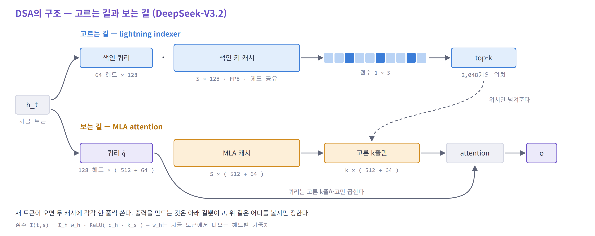

| # | 연산 | 식 | shape | 종류 |
|---|---|---|---|---|
| 0 | 색인 키 쓰기 | `k_I = x · W_k` | `(S × 128)` 캐시에 한 줄 | 메모리 쓰기 (토큰마다) |
| 1 | 색인 쿼리 만들기 | `q_I` | `(64 × 128)` | 행렬 × 벡터 |
| 2 | **점수** | `q_I · k_Iᵀ` | `(64 × 128) × (128 × S)` → `(64 × S)` | **행렬 × 행렬** — 캐시를 읽는다 |
| 3 | ReLU · 헤드 가중합 | `Σ w_h · ReLU( · )` | `(64 × S)` → `(1 × S)` | 원소별 연산 |
| 4 | **top-k** | 큰 것 2,048개의 위치 | `(1 × S)` → 정수 2,048개 | **비교 · 선택** |

과거 토큰마다 점수가 하나씩 나온다. (숫자는 예시다)

```
 토큰      1      2      3      4      5      6      7      8   …
 점수    0.01    0     0.72   0.13   0.91    0     0.02   0.83  …
                                ↓  top-k
 위치    [ 3, 5, 8, … ]          ← MLA에 넘기는 것은 이것뿐이다
```

<details>
<summary>자세히 — indexer의 계산과 고른 위치를 쓰는 방법</summary>

DeepSeek-V3.2 공개 코드 기준이다. attention에서 **점수를 내는 단계만** 작게 떼어 놓은 것이다. softmax도 없고 V도 없다.

**준비 — 토큰이 들어올 때마다 (쓰기)**

```
k_I = norm( x · W_k )            128차원 벡터 하나
→ 색인 키 캐시 끝에 한 줄 붙인다     캐시는 ( S × 128 ), FP8
```

- 본 attention의 K에 해당한다. 다만 헤드마다 따로 두지 않고 **하나만** 둔다

**점수 — 토큰을 하나 만들 때마다 (읽기)**

```
① 색인 쿼리     q_I = c_Q · W_q                      ( 64 × 128 )      헤드 64개
② 헤드별 가중치  w   = x · W_w                        ( 64 )            헤드마다 숫자 하나
③ 내적         q_I · k_Iᵀ    ( 64 × 128 ) × ( 128 × S )  →  ( 64 × S )
④ ReLU         음수를 0으로 만든다                      ( 64 × S )
⑤ 가중합        헤드 방향으로 w를 곱해 더한다             →  ( 1 × S )
```

한 줄로 쓰면 과거 토큰 `s`의 점수는

```
I(t, s) = Σ_h  w_h · ReLU( q_h · k_s )
```

- `q_h · k_s`는 색인 쿼리 헤드 `h`와 토큰 `s`의 색인 키를 내적한 숫자 하나다
- 헤드 64개가 각자 낸 숫자를 ReLU로 걸러서, 가중치 `w_h`를 곱해 더한다. 과거 토큰마다 **점수 하나**가 나온다
- `c_Q`는 본 attention의 쿼리를 만들 때 쓰는 중간 벡터(1,536차원)다. 색인 쿼리도 같은 벡터에서 만든다
- 이렇게 작은 중간 벡터를 거쳐 만드는 것을 **low-rank**라고 한다. `x`(7,168차원)에서 바로 큰 행렬 하나로 만들지 않고, 작은 차원(1,536)으로 한 번 줄였다가 펴는 **행렬 둘**로 나눈 것이다. 가중치와 곱셈이 줄어든다
- 캐시를 읽는 것은 ③ 하나다. 한 줄이 128바이트라서 `S`줄을 다 훑어도 가볍다 (MLA 캐시 한 줄은 1,152바이트)

**고르기**

```
⑥ top-k        점수 ( 1 × S ) 에서 큰 것 2,048개의 위치를 뽑는다   →  정수 2,048개
```

**고른 위치를 본 attention에 쓰는 방법 — 두 가지다**

| | 마스크로 가린다 | 고른 줄만 읽는다 (gather) |
|---|---|---|
| 하는 일 | `( 1 × S )` 표를 만든다. 고른 위치는 0, 나머지는 `−∞`. 이것을 본 attention의 점수에 더한다 | 커널이 위치 목록을 받아, 그 위치의 줄만 캐시에서 읽어 온다 |
| 그다음 | softmax를 거치면 가린 자리의 비중이 0이 된다 | 읽어 온 2,048줄에 대해서만 점수를 내고 섞는다 |
| 읽는 양 | **캐시 전체** — 점수는 `S`줄 다 계산한다 | **고른 2,048줄** |
| 어디서 쓰나 | 모델과 함께 공개된 참조 코드 | 서빙용 커널 — FlashMLA, vLLM, SGLang |

- 결과는 같다. 가린 자리의 비중이 0이므로 고른 줄만 계산한 것과 같은 출력이 나온다
- 참조 코드는 **마스크 방식**이다. 읽기 쉽지만 읽는 양은 줄지 않는다
- 읽는 양이 실제로 줄어드는 것은 **gather 방식**이다. 이 자료의 "고른 `k`줄만 읽는다"는 이쪽을 가리킨다

**서빙용 커널에서 확인한 것**

| | 확인한 내용 |
|---|---|
| [FlashMLA](https://github.com/deepseek-ai/FlashMLA) (DeepSeek의 커널) | `indices` 텐서 `(batch, 쿼리 수, topk)`를 받아 "지정한 토큰에 대해서만 attention을 계산한다". 문서가 같은 동작을 `focused_kv = kv[indices]`로 적어 둔다. decode 커널 코드는 위치마다 캐시의 한 줄을 읽어 오는 gather를 쓴다 |
| [vLLM](https://github.com/vllm-project/vllm/blob/main/vllm/v1/attention/backends/mla/flashmla_sparse.py) | indexer가 고른 위치를 캐시 안의 실제 자리로 바꿔 FlashMLA 커널에 넘긴다 |
| [SGLang](https://github.com/sgl-project/sglang/blob/main/python/sglang/kernels/ops/attention/nsa_triton_decode/triton_mla_kernels_decode_fused.py) | decode 커널 이름이 "Fused Gather + Dequant + Attention"이다. 첫 단계가 "희소 위치에서 KV를 읽어 온다"다 |

- 세 곳 모두 **gather가 attention 커널 안에 들어 있다.** 고른 줄을 모아 둔 텐서를 메모리에 따로 만들지 않고, 캐시에서 읽어 온 줄을 바로 계산에 쓴다
- 위치는 "캐시의 몇 번째 블록, 그 안의 몇 번째 줄"로 넘긴다. 캐시가 블록 단위로 나뉘어 있기 때문이다
- FlashMLA의 최신 문서와 SGLang의 이 커널은 DeepSeek-V4 계열 기준으로 쓰여 있다. DSA(V3.2)용 희소 커널은 FlashMLA에 2025년 9월에 들어갔다

</details>

---

#### 읽는 양

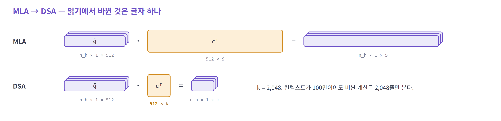

- MLA의 식은 그대로다. 바뀐 것은 **글자 하나** — 캐시 쪽의 `S`가 `k`가 됐다
- 컨텍스트가 100만 줄이어도 MLA가 읽는 것은 **2,048줄**이다
- indexer가 읽는 `S`줄을 합쳐도, MLA만 쓸 때의 약 1/9이다

<details>
<summary>자세히 — 읽는 양을 숫자로</summary>

컨텍스트 1M, 층 하나, 토큰 하나를 만들 때 (개략 계산, MLA 캐시는 BF16 기준)

| | 읽는 것 | 양 | 접근 |
|---|---|---|---|
| MLA만 | latent 100만 줄 | 약 1.15 GB | 이어서 |
| DSA — 고르기 | 색인 키 100만 줄 | 약 128 MB | 이어서 |
| DSA — 보기 | latent 2,048줄 | 약 2.4 MB | 흩어져서 |

61개 층을 다 합치면 약 70 GB가 약 8 GB로 줄어든다.

**계산**

| | 계산 | 값 |
|---|---|---|
| MLA 캐시 한 줄 | 576개 값 × 2 B (BF16) | 1,152 B |
| MLA만, 층 하나 | 1,000,000줄 × 1,152 B | 약 1.15 GB |
| 색인 키, 층 하나 | 1,000,000줄 × 128 B (FP8) | 약 128 MB |
| 고른 latent, 층 하나 | 2,048줄 × 1,152 B | 약 2.4 MB |
| 61층 합 | 1.15 GB × 61 → (128 MB + 2.4 MB) × 61 | 약 70 GB → 약 8 GB |

- H100 대역폭(3.35 TB/s)으로 나누면 약 21 ms 대 약 2.4 ms다. 흩어진 읽기와 top-k의 비용은 넣지 않은 하한이다
- MLA 캐시를 FP8로 두면 두 경우 모두 줄어든다

</details>

---

#### 추가되는 연산

지금까지는 전부 행렬곱이었다. DSA에서 처음으로 **행렬곱이 아닌 일** 둘이 생긴다.

- **top-k** — 곱하는 일이 아니라 **비교해서 고르는 일**이다. GPU는 행렬곱에 맞춰 만들어진 장치라, top-k는 그만큼 효율적으로 돌지 않는다. 곱셈 횟수(FLOPs)로는 세어지지도 않는다
- **gather** — 고른 줄이 컨텍스트 여기저기에 흩어져 있다. 이어진 구간을 쭉 읽을 때와 달리 **메모리 대역폭을 다 쓰지 못한다**
- 둘 다 토큰을 하나 만들 때마다, 층마다 되풀이한다
- 읽어 온 뒤의 계산은 다시 **dense 행렬곱**이다. sparse한 것은 연산이 아니라 **어느 줄을 읽느냐**다

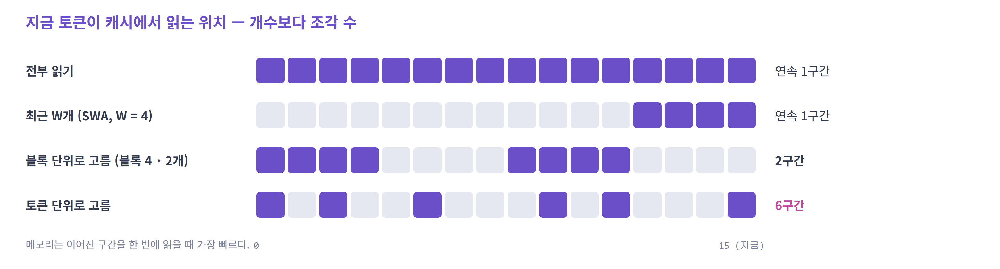

> **읽는 개수가 같아도 몇 조각으로 흩어졌는지가 속도를 정한다.**

---

#### 시스템 동작에서 달라지는 것

- **읽기가 두 종류가 된다** — 작은 줄을 처음부터 끝까지 훑는 읽기(색인 키)와, 큰 줄을 몇 개만 집어 오는 읽기(latent)
- **어디를 읽을지가 실행 중에 정해진다.** 점수를 내기 전에는 알 수 없고, 토큰마다 · 층마다 · 요청마다 다르다
- **캐시가 하나 더 생긴다.** 색인 키 캐시만큼 저장량이 약 11% 늘어난다

---

#### DSA 정리

1. MLA 앞에 **indexer**를 둬서, 읽을 2,048줄을 먼저 찾는다 — 압축(MLA)과 선택이 처음 만난 지점
2. indexer의 목표는 **높은 recall**이다. 놓치지만 않으면 되므로 싸게 만든다
3. 남는 비용 셋 — **indexer의 전체 훑기 · top-k · 흩어진 읽기**

---

DSA에는 길이에 비례하는 비용이 남아 있었다. **indexer가 모든 토큰을 훑어야** 하기 때문이다.

DeepSeek-V4의 답은 두 단계를 겹치는 것이었다. **먼저 토큰들을 묶어 개수를 줄이고, 그 위에서 고른다.**
그리고 한 걸음 더 나가, 아주 세게 묶어서 **아예 고를 필요가 없는 층**도 만들었다.

---

### 4.3 CSA · HCA — 묶고 나서 고른다

*Compressed Sparse Attention · Heavily Compressed Attention*

> **CSA · HCA** · 2026 · DeepSeek
> DeepSeek-V4-Pro (1.6T) · V4-Flash (284B) — **1M 컨텍스트가 목표**

DSA는 **읽는 양**을 줄였다. **캐시에 쌓이는 양은 그대로**다. 토큰마다 엔트리 하나, 모두 `S`개다.
그래서 indexer는 `S`개를 전부 훑고, 캐시도 `S`에 비례해 자란다.

**쌓이는 엔트리 수를 줄이면 된다.** 토큰 여러 개를 엔트리 하나로 묶는다.

#### 줄이는 축이 다르다

KV cache를 표 하나로 놓고 본다. **한 줄이 토큰 하나**다.

- **컨텍스트의 토큰 수** `S` (sequence length) — 토큰이 하나 생길 때마다 한 줄 늘어난다
- **토큰 하나당 차원** — 토큰 하나가 남기는 값의 개수다. MHA라면 K·V 2 × 헤드 128 × 헤드 차원 128 = 32,768

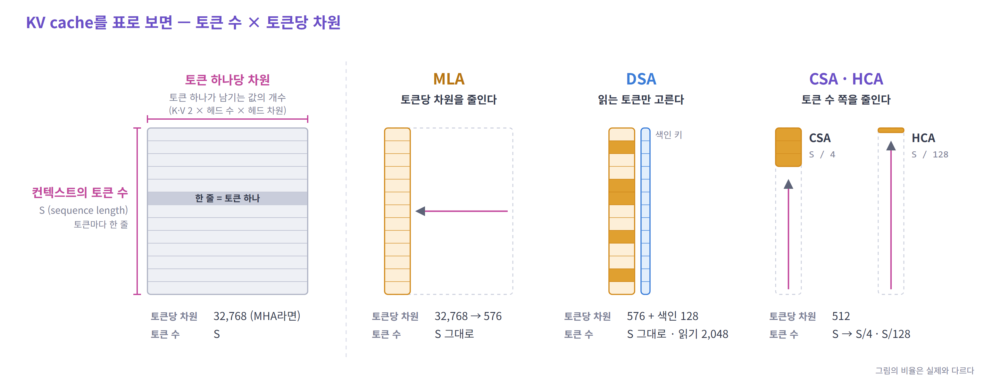

- **MLA — 토큰당 차원**을 줄였다 (32,768 → 576). 토큰 수는 `S` 그대로다
- **DSA — 저장은 그대로.** 읽는 토큰만 골랐다
- **CSA · HCA — 토큰 수 쪽**을 줄인다. 캐시 길이가 `S`에서 `S/4`, `S/128`이 된다

두 축은 서로 독립이라 함께 줄일 수 있다.
V4의 엔트리 하나는 512차원이고, MLA의 latent와 달리 **그대로 K이자 V**다. 펴는 행렬이 없다.

---

#### 해법 — DSA 앞에 압축 단계를 둔다

DSA는 그대로 두고, 그 **앞에 압축 단계 하나를 추가**한다. 몇 개씩 묶느냐에 따라 층이 두 종류다.

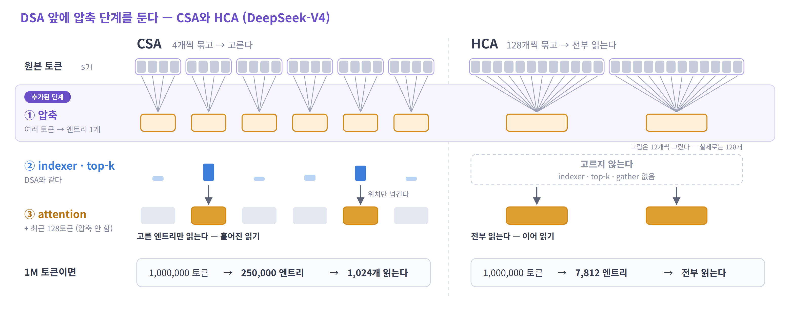

**CSA — 4개씩 묶고, 고른다**

- 캐시 길이가 `S/4`가 된다
- 그 위에서 **DSA를 그대로** 한다. indexer가 점수를 매기고, 1,024개 엔트리만 읽는다
- indexer가 훑는 양이 **1/4**이다. 색인 키도 같은 방식으로 묶는다 (FP4)
- top-k와 gather는 남는다

**HCA — 128개씩 묶고, 전부 읽는다**

- 캐시 길이가 `S/128`이 된다. 100만 토큰이 **7,812 엔트리**다. 고를 필요가 없다
- **indexer · top-k · gather가 없다.** 처음부터 끝까지 이어 읽는 **dense 행렬곱 하나**다
- 어디를 읽을지가 실행 전에 정해져 있다
- 대신 128개가 하나로 뭉개진다

압축은 **토큰이 모일 때 한 번** 한다. 읽을 때마다 하는 일이 아니라 쓰기 쪽의 일이다.

> **CSA는 DSA의 "전부 훑기"를 1/4로 줄였다. HCA는 DSA에서 생긴 "행렬곱이 아닌 일" 둘을 없앴다.**

---

#### 여러 토큰을 어떻게 하나로 묶나

**평균을 내지 않는다. 섞는 비율을 학습한다.**

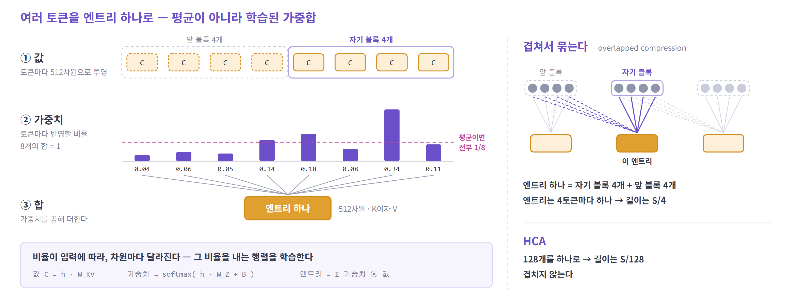

1. **값** — 토큰마다 512차원 벡터로 투영한다
2. **가중치** — 토큰마다 얼마나 반영할지를 정한다. 묶이는 토큰들의 가중치 합은 1이다
3. **합** — 값에 가중치를 곱해 더한다. 이것이 엔트리 하나다

- 평균이라면 가중치가 전부 같다. 여기서는 **입력에 따라, 차원마다** 달라진다
- **겹쳐서 묶는다** (overlapped compression) — 엔트리 하나에 자기 블록 4개와 앞 블록 4개가 들어간다. 엔트리는 4토큰마다 하나라 길이는 `S/4`다
- 연산은 **행렬곱(투영) → softmax → 원소별 곱과 합**이다. 컨텍스트 길이와 무관하다

<details>
<summary>자세히 — 묶는 식과 두 층에 공통인 것</summary>

**CSA** — 묶는 단위 `m` = 4

```
C^a = H · W^aKV      C^b = H · W^bKV        값 두 벌        (S × 512)
Z^a = H · W^aZ       Z^b = H · W^bZ         가중치 두 벌     (S × 512)

[S^a ; S^b]  =  softmax( [ Z^a(자기 블록 4개) + B^a ;  Z^b(앞 블록 4개) + B^b ] )     8개에 걸쳐 정규화
엔트리 i     =  Σ S^a ⊙ C^a (자기 블록)  +  Σ S^b ⊙ C^b (앞 블록)                    ⊙ 는 원소별 곱
```

- `B^a`, `B^b`는 블록 안의 자리마다 학습되는 bias다 (`4 × 512`)
- 가중치 `Z`가 값과 같은 512차원이다. softmax는 차원마다 따로, 8개 토큰에 걸쳐 건다
- 첫 엔트리는 앞 블록이 없어서 그쪽 가중치를 `-inf`로 채운다
- 색인 키도 같은 방식으로 묶는다 (`S/4`개, 128차원)

**HCA** — 묶는 단위 `m'` = 128

- 값 한 벌 · 가중치 한 벌. 앞 블록과 겹치지 않는다
- 묶은 결과를 고르지 않고 전부 읽는다

**두 층에 공통인 것**

| 항목 | 내용 |
|---|---|
| 본 attention | 쿼리 헤드 128개(Flash는 64개), 헤드 차원 512, KV 헤드 1개. 엔트리가 키이자 값이다 (shared key-value MQA) |
| RoPE | 벡터의 마지막 64차원에만 건다. 값으로도 쓰이므로 출력에는 반대 방향 회전을 한 번 더 건다 |
| 최근 토큰 | 압축하지 않은 최근 128토큰을 함께 읽는다 |
| attention sink | 헤드마다 학습되는 값을 softmax 분모에 더한다. 점수 합이 1보다 작아질 수 있다 |
| 출력 | 헤드 출력을 그룹으로 나눠 줄인 뒤 합친다 (Pro는 16그룹) |

</details>

---

#### 잃는 것

- **되돌릴 수 없다.** 엔트리에서 원래 토큰들을 복원할 수 없고, attention은 그 토큰들을 따로 구분해 보지 못한다
- 정확한 문구나 위치 같은 **세부 정보가 흐려진다.** 128개를 묶는 HCA가 훨씬 많이 잃는다
- 그래서 두 층 모두 **압축하지 않은 최근 128토큰**을 함께 읽는다. 아직 엔트리가 되지 않은 끝 토큰도 여기서 본다

---

#### 텐서 연산으로 보면

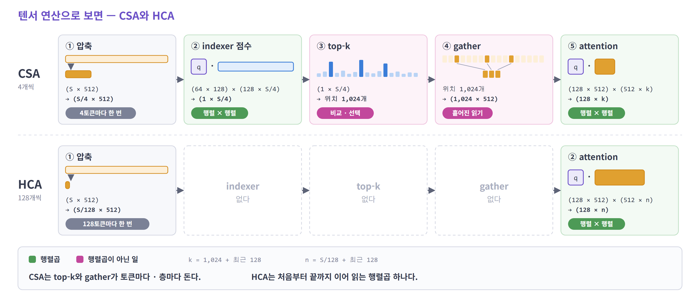

- **CSA** — DSA와 같은 구조에 길이만 `S/4`다. 다섯 단계 중 둘(top-k, gather)이 행렬곱이 아니다
- **HCA** — 압축과 attention 둘뿐이다. 읽는 양 `S/128`은 여전히 컨텍스트 길이에 비례하지만 계수가 작다
- 두 층 모두 캐시가 **한 장**이다 (KV 헤드 1개). 쿼리 헤드 128개가 같은 엔트리를 읽는다

---

#### CSA와 HCA의 역할

| | CSA | HCA |
|---|---|---|
| 묶는 단위 | 4개 (앞 블록과 겹쳐서) | 128개 |
| 1M 토큰이면 | 250,000 엔트리 | 7,812 엔트리 |
| 그중 읽는 것 | **상위 1,024개** | **전부** |
| 보는 방식 | 일부를 정밀하게 | 전체를 거칠게 |
| top-k · gather | 있다 | **없다** |

두 역할을 한 층에 넣지 않는다. **층을 번갈아 쌓아** 나눠 맡는다.

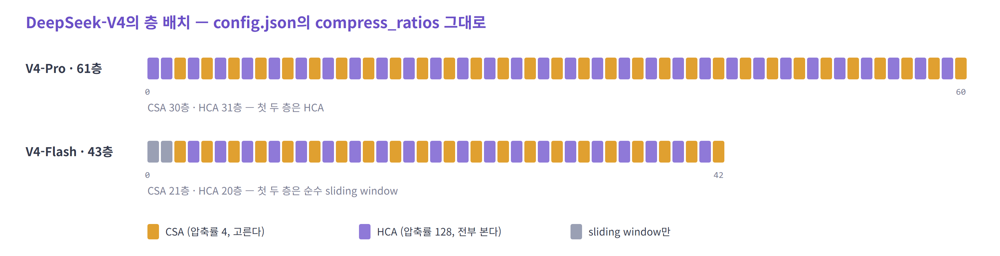

> **어느 한쪽이 보조가 아니다. "정밀하게 조금" 층과 "거칠게 전부" 층이 반반이다.**

---

#### V3.2 대비 수치

1M 컨텍스트, DeepSeek-V3.2(DSA) 대비

| | 토큰 하나 추론 FLOPs | KV cache |
|---|---|---|
| V4-Pro | **27%** | **10%** |
| V4-Flash | **10%** | **7%** |

KV는 10%인데 FLOPs는 27%다. **압축 자체가 연산**이기 때문이다.

> **MLA 때와 같은 거래다. 메모리를 아끼고 연산으로 낸다.**

---

#### 시스템 동작에서 달라지는 것

- **쓰기가 "한 줄 붙이기"가 아니다.** 토큰이 4개(또는 128개) 모여야 엔트리 하나가 생긴다. 그 전까지는 끝 토큰을 따로 들고 있어야 한다
- **캐시가 한 종류가 아니다.** 길이가 `S/4`, `S/128`, 128 고정(최근 토큰) 세 가지이고, 정밀도도 BF16 · FP8 · FP4가 섞인다
- **같은 크기의 페이지로 관리하던 방식이 맞지 않는다.** 논문은 캐시 배치를 따로 설계했다 (heterogeneous KV cache)
- **캐시를 SSD에 내려 둔다.** 앞부분이 같은 요청이 오면 prefill을 다시 하지 않고 읽어 온다

<details>
<summary>자세히 — SSD에 저장하는 방식</summary>

앞부분(prefix)이 같은 요청이 다시 오면 저장해 둔 캐시를 읽어 prefill을 건너뛴다.

**압축 엔트리 (CSA · HCA)**

- 전부 저장한다. 요청이 저장된 앞부분과 겹치면 마지막으로 꽉 찬 블록까지 읽어 온다
- 끝의 덜 찬 블록에 해당하는 토큰은 다시 계산한다

**압축하지 않은 최근 토큰용 캐시**

모든 층에 있고 압축되지 않아, 전부 저장하면 압축 엔트리의 약 8배다. 세 가지 중에서 고른다.

| 방식 | 저장 | 다시 계산 | 특징 |
|---|---|---|---|
| 전부 저장 | 모든 토큰 | 없음 | 저장한 것 대부분이 다시 읽히지 않는다. 쓰기만 많은 패턴이 된다 |
| 주기적 저장 | `p`토큰마다 최근 128토큰분 | 마지막 저장 지점 이후 | `p`로 저장량과 계산량을 맞바꾼다 |
| 저장 안 함 | 없음 | 마지막 128 × 층 수 토큰 | 압축 엔트리만으로 복원한다 |

</details>

---

#### CSA · HCA 정리

1. MLA는 토큰당 차원을, CSA · HCA는 **토큰 수 쪽**을 줄인다
2. CSA는 4개씩 묶고 고른다. HCA는 128개씩 묶고 전부 읽는다 — 두 층을 1:1로 번갈아 쌓는다
3. 묶는 방법은 평균이 아니라 **학습된 가중합**이고, 되돌릴 수 없다

---

### 짚어 둘 점

**층마다 접근 패턴이 다르다**

- CSA 층은 훑기 + 흩어진 읽기, HCA 층은 이어 읽기다. top-k와 gather를 치르는 층은 절반이다
- 비용은 층 종류별로 따로 적고 층 수로 더한다 (V4-Pro는 CSA 30층 + HCA 31층). 평균적인 층 하나로 뭉치면 이 차이가 사라진다

---

이 문제를 DeepSeek만 푼 것은 아니다. Qwen도 같은 지점에서 출발해 **"먼저 묶고 나서 고른다"** 는 같은 답에 닿았다.
다만 **무엇을 묶는지**와 **어떤 층과 함께 쓰는지**가 다르다.

---

### 4.4 QSA — 블록 단위로 고른다

*Qwen Sparse Attention*

> **QSA** · 2026 · Alibaba (Qwen)
> Qwen3.8-Flash-Next (125B) — 48층 중 12층

출발점은 CSA와 같다. **DSA의 indexer가 토큰 `S`개를 전부 훑는다.**
답도 같다. 먼저 묶고, 그다음 고른다. **다른 것은 무엇을 묶느냐다.**

#### 해법 — 색인 키만 묶고, 원본 토큰을 읽는다

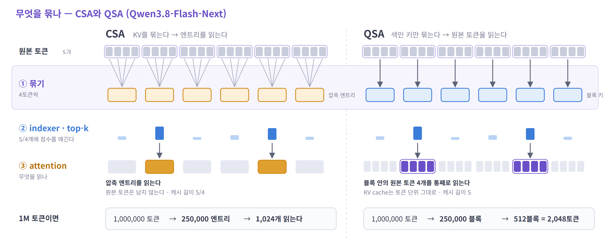

| | CSA | QSA |
|---|---|---|
| 묶는 것 | attention이 읽는 **KV** | indexer의 **색인 키만** |
| 묶는 방법 | 학습된 가중합 | 4토큰의 평균 |
| 고르는 단위 | 압축 엔트리 1,024개 | 블록 512개 |
| 읽는 것 | 압축 엔트리 | **블록 안의 원본 토큰 4개** (모두 2,048토큰) |
| 캐시 길이 | `S/4` | **`S` 그대로** |

- CSA는 토큰을 합쳐 새 엔트리를 만든다. 원본은 남지 않는다
- QSA의 블록은 **고르는 단위**일 뿐이다. 고른 뒤에는 원본 토큰을 그대로 읽으므로 세부 정보를 잃지 않는다
- 대신 저장은 줄지 않는다

> **CSA는 저장과 검색을 함께 줄인다. QSA는 검색만 줄인다.**

<details>
<summary>자세히 — QSA의 indexer</summary>

```
색인 키      k_i   = W_K · x_i                      토큰마다 하나
블록 키      k̂_b   = RMSNorm( 평균( k_i, 블록 b의 r개 ) )
점수         I(i, b) = Σ_h ReLU( q_i^h · k̂_b )       꽉 찬 블록에 대해서만
고르는 개수   블록 ⌈K / r⌉개
```

| 항목 | 값 |
|---|---|
| 색인 쿼리 | 헤드 4개, 헤드당 128차원 |
| 색인 키 | 헤드 공유 하나 (MQA 형태) |
| 블록 크기 `r` · 예산 `K` | 4토큰 · 2,048토큰 → 블록 512개 (공개 설정) |
| RoPE | 128차원 중 64차원에만. **평균을 낸 뒤에** 블록의 시작 위치로 건다 |

- 평균을 먼저 내고 위치를 나중에 입힌다. 회전 각이 다른 토큰들을 그대로 평균하지 않기 위해서다
- 고른 블록은 원래 토큰 위치로 펼쳐서 본 attention(GQA)이 읽는다
- 아직 덜 찬 마지막 블록의 토큰은 고르는 과정 없이 항상 읽는다

</details>

---

#### indexer 비용이 줄어드는 이유

- 점수를 매길 대상이 **`S`개에서 `S/4`개**가 된다. 100만 토큰이면 25만 블록이다
- 색인 쿼리 헤드가 **4개**다 (DSA는 64개)
- 컨텍스트 길이에 비례하는 것은 그대로다. `S`가 `S/4`가 됐을 뿐이다

> **차수는 그대로다. 줄어든 것은 실제로 읽고 곱하는 양이다.**

---

#### 읽기 — 블록을 통째로 가져온다

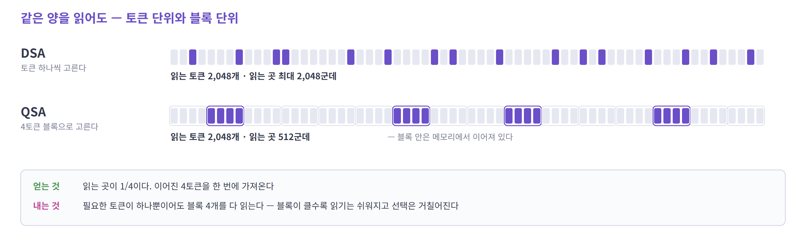

- 읽는 토큰 수는 DSA와 같은 2,048개다. **읽는 곳이 2,048군데에서 512군데**로 줄어든다
- 블록 안의 4토큰은 메모리에서 이어져 있다. 한 번에 가져온다
- 내는 것도 있다. 필요한 토큰이 하나뿐이어도 블록 4개를 다 읽는다
- 블록이 클수록 읽기는 쉬워지고 선택은 거칠어진다

> **HCA는 gather를 없앴다. QSA는 gather의 단위를 키웠다.**

---

#### 텐서 연산으로 보면

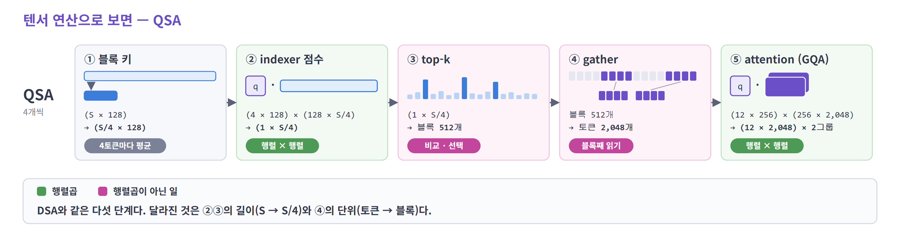

- DSA와 같은 다섯 단계다. 달라진 것은 **②③의 길이**(`S` → `S/4`)와 **④의 단위**(토큰 → 블록)다
- ①은 평균이다. 학습된 가중합을 쓰는 CSA의 압축보다 가볍다
- 본 attention은 GQA다 (쿼리 헤드 24 · KV 헤드 2 · 헤드 차원 256). 압축하지 않은 KV를 읽는다

---

#### Gated DeltaNet과 함께 쓴다

QSA는 모델의 모든 층에 있지 않다. **넷 중 한 층**이다.

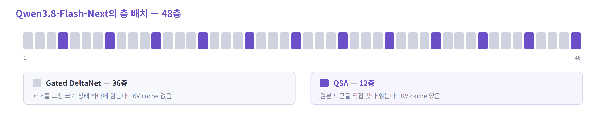

- 세 층은 Gated DeltaNet이다. 과거를 **고정 크기 상태 하나**에 담는다. KV cache가 없다
- 고정 크기 상태는 특정 토큰을 정확히 되찾기 어렵다
- **QSA 층의 역할이 그것이다 — 원본 토큰을 직접 찾아 읽는다**
- 그 12개 층조차 전부 읽지 않는다. 2,048토큰만 읽는다

---

#### 시스템 동작에서 달라지는 것

- **길이에 따라 자라는 캐시는 48층 중 12층에만 있다**
- **성격이 반대인 메모리가 한 모델 안에 있다.** KV cache는 한 번 쓰고 계속 읽는다. 고정 크기 상태는 크기가 일정한 대신 **토큰마다 전체를 고쳐 쓴다**

---

#### QSA 정리

1. 색인 키만 4토큰씩 묶어 **블록 단위로 고르고, 원본 토큰을 읽는다**
2. indexer가 훑는 양과 읽는 곳이 1/4이 된다. 캐시 크기는 줄지 않는다
3. 모델 안에서 맡은 일은 **원본 토큰을 정확히 되찾는 것**이다

> **묶는 방식은 두 회사가 같은 곳으로 모였고, 무엇과 결합할지는 갈렸다.**

---

여기까지가 KV cache를 줄여 온 과정이다. 헤드를 공유하고, 값을 압축하고, 최근 것만 읽고, 골라 읽고, 묶어서 읽었다.
그런데 어느 방법도 **캐시를 없애지는 못했다.**

---

## 5. 정리

### 기법 요약

| 기법 | 저장하는 것 | 본 attention이 읽는 범위 | 추가 비용 |
|---|---|---|---|
| MHA | 헤드마다 K, V | 전부 | 기준점 |
| MQA · GQA | 공유한 K, V | 전부 | 표현력 |
| **MLA** | latent 하나 + RoPE 조각 | 전부 | 쿼리 쪽 곱셈 · 전용 커널 |
| SWA | 최근 `W`개 | 최근 `W`개 | 윈도우 밖을 못 본다 |
| **DSA** | MLA 캐시 + 색인 키 | 고른 `k`개 | 색인 훑기 · top-k · gather |
| **CSA** | 길이 1/4의 엔트리 + 색인 키 | 고른 엔트리 | 압축 연산 · top-k · gather |
| **HCA** | 길이 1/128의 엔트리 | 압축 결과 전부 | 세부 정보 손실 |
| **QSA** | 일부 층의 KV + 길이 1/4의 색인 키 | 고른 블록 | 색인 훑기 · top-k · 블록 단위 gather |

> **이름은 많지만 질문은 셋이다.
> 토큰 하나를 얼마나 얇게 저장할까. 그중 몇 개를 읽을까. 고르는 비용은 어떻게 낼까.**

---

### 기법별 비용 항목

토큰 하나, 층 하나 기준. 바이트는 개략 계산이다.

| 기법 | 저장 (토큰당) | 한 스텝에 읽는 줄 | 접근 | 행렬곱이 아닌 일 |
|---|---|---|---|---|
| MHA (128 헤드) | 64 KiB | `S` | 이어서 | — |
| GQA (`n_kv`=8) | 4 KiB | `S` | 이어서 | — |
| MLA | 1,152 B | `S` | 이어서 | — |
| SWA | `W`줄에서 상한 | `W` | 이어서 | 오래된 줄 버리기 |
| DSA | 1,152 B + 128 B | 색인 `S` + latent `k` | 이어서 + 흩어져서 | top-k |
| CSA | 약 160 B | 색인 `S/4` + 엔트리 `k` | 이어서 + 흩어져서 | top-k · 압축 |
| HCA | 약 4.5 B | `S/128` | 이어서 | 압축 |
| QSA | 토큰 단위 KV + 색인 키 (4층 중 1층만) | 색인 `S/4` + 토큰 2,048 | 이어서 + 블록 단위로 | top-k |

- V4의 바이트는 엔트리 하나를 576 B(FP8 448차원 + BF16 64차원)로 놓고 길이 압축률로 나눈 값이다
- 한 스텝에 읽는 양은 "읽는 줄 × 한 줄의 크기"이고, 여기에 층 수와 요청 수가 곱해진다

---

### 시스템 동작의 변화

| | 처음 (MHA) | 지금 (DSA · V4 · QSA) |
|---|---|---|
| 쓰기 | 토큰마다 한 줄 붙이기 | 묶일 때까지 모았다가 쓰기, 오래된 줄 버리기 |
| 읽기 | 전부, 이어서 | 좁은 색인을 훑고, 넓은 캐시에서 골라 읽기 |
| 읽을 주소 | 미리 안다 | 실행 중에 정해진다 |
| 읽은 값의 재사용 | 헤드 하나가 한 번 | 여러 헤드가 함께 |
| 연산의 종류 | 행렬 × 벡터 | 여기에 top-k, 압축 |
| 캐시의 종류 | 한 가지 | 길이·한 줄의 크기·정밀도·수명이 다른 여러 가지 |
| 캐시가 있는 곳 | GPU 메모리 | GPU 메모리와 SSD |

- **토큰당 바이트는 계속 줄었다** — 64 KiB → 4 KiB → 1 KiB 남짓 → 백 바이트 안팎
- **그 사이 컨텍스트는 32K에서 1M으로 늘었다** — 줄인 만큼을 길이가 가져갔다
- **한 번 쓰고 계속 읽는 성격은 그대로다** — 달라진 것은 읽는 범위와 읽는 순서다

---

### 한계와 다음 주제

- 어떤 방법도 **KV를 완전히 없애지는 못했다** — 저장은 여전히 길이에 비례하거나, 상한을 두는 대신 정보를 버렸다
- 다음 이야기: 애초에 토큰마다 무언가를 남기지 않는다면? → 선형 attention
- 그리고 둘은 한 모델 안에서 만난다 — Qwen3.8-Flash-Next가 그 예다

---

### 짚어 둘 점

**병목이 용량인가, 대역폭인가**

- 동시 요청이 많으면 **용량**이 먼저 찬다 — 캐시의 크기는 살아 있는 요청들의 토큰 총합이 정한다
- 요청 하나가 아주 길면 **대역폭**이 먼저 걸린다 — 토큰 하나를 만들 때마다 그 요청의 캐시를 읽는다

**top-k와 gather의 비용**

- 둘 다 곱셈 횟수로 세어지지 않아, 연산량과 읽는 양만으로 만든 비용 모델에서는 빠진다
- gather는 읽는 양이 같아도 조각 수에 따라 걸리는 시간이 달라진다. top-k는 훑는 점수의 개수에 따라 늘어난다
- HCA(고르지 않는다)와 QSA(블록 단위로 읽는다)는 둘 다 이 비용을 피하는 방향이다

**겹쳐 쓰는 흐름**

- 압축(MLA)과 선택(DSA)이 먼저 겹쳐졌고, V4에서 길이 압축이 더해졌다
- 지금 더해지고 있는 것은 층 사이 공유(고른 결과를 여러 층이 함께 쓴다), 선형 attention과의 혼합(Qwen3.8), 저장 계층(SSD)이다

---

### 참고

- [Attention Is All You Need](https://arxiv.org/abs/1706.03762) — MHA
- [Fast Transformer Decoding: One Write-Head is All You Need](https://arxiv.org/abs/1911.02150) — MQA
- [GQA: Training Generalized Multi-Query Transformer Models](https://arxiv.org/abs/2305.13245)
- [DeepSeek-V2](https://arxiv.org/abs/2405.04434) · [DeepSeek-V3 추론 코드](https://github.com/deepseek-ai/DeepSeek-V3) — MLA
- [Mistral 7B](https://arxiv.org/abs/2310.06825) — SWA
- [DeepSeek-V3.2-Exp](https://github.com/deepseek-ai/DeepSeek-V3.2-Exp) — DSA
- [FlashMLA](https://github.com/deepseek-ai/FlashMLA) · [vLLM의 희소 MLA 백엔드](https://github.com/vllm-project/vllm/blob/main/vllm/v1/attention/backends/mla/flashmla_sparse.py) · [SGLang의 희소 decode 커널](https://github.com/sgl-project/sglang/blob/main/python/sglang/kernels/ops/attention/nsa_triton_decode/triton_mla_kernels_decode_fused.py) — 고른 줄만 읽는 서빙용 커널
- [DeepSeek-V4](https://arxiv.org/abs/2606.19348) — CSA · HCA, KV cache 배치와 SSD 저장
- [Qwen3.8-Next](https://arxiv.org/abs/2608.30320) — QSA
- 모델 설정: Hugging Face의 `config.json` (Qwen3-235B-A22B, gpt-oss-120b, Kimi-K2, DeepSeek-V4-Pro / Flash)
- 더 자세한 내용: `00-foundations.md`, `01-attention.md`
