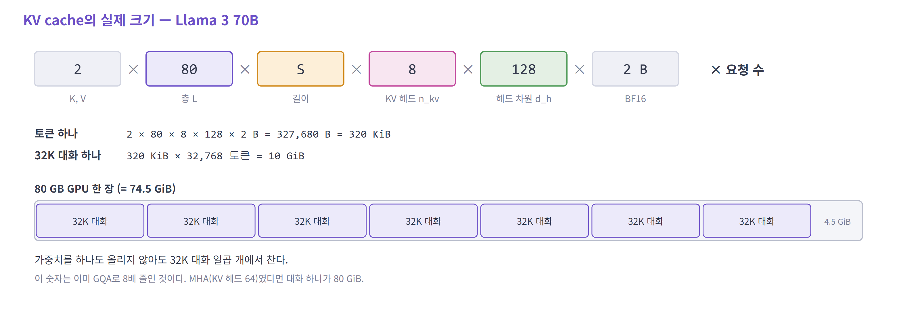
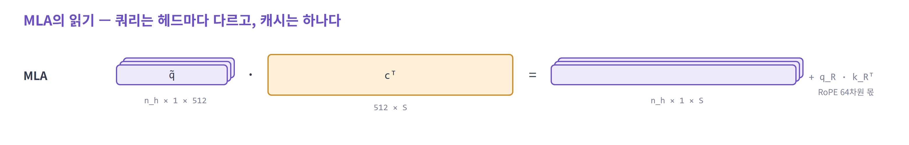

# Attention

> Attention이 어떤 연산으로 이루어지는지 보고, 그 안에서 KV cache가 차지하는 부분과 문제를 정리한다.
> 이후는 KV cache를 줄이는 기법들이다. 모든 내용은 decode(토큰을 하나씩 생성하는 단계) 기준이다.

| 순서 | 내용 | 깊이 |
|---|---|---|
| 1 | Attention 연산 | 기본 |
| 2 | KV cache — 연산에서의 역할, 크기, 문제, 줄이는 방향 | 기본 |
| 3 | **저장을 줄인다** — MHA · MQA · GQA · **MLA** | MLA를 자세히 |
| 4 | **읽기를 줄인다** — SWA · **DSA** · **CSA/HCA** · **QSA** | SWA만 간단히 |
| 5 | 정리 | |

---

## 1. Attention 연산

### Attention이 하는 일

- `q` — 지금 토큰이 찾고 싶은 것
- `K` — 과거 토큰들의 색인
- `V` — 골라졌을 때 가져갈 내용
- `q @ Kᵀ`로 점수를 내고, 그 점수로 `V`를 섞어 가져온다

헤드 하나는 점수 분포 하나를 만든다. 서로 다른 관계를 동시에 보려고 헤드를 여러 개 둔다.

---

### decode 한 스텝

토큰 하나를 만드는 순간이다. 헤드 하나만 떼어서 본다.


> **입력도 한 줄, 출력도 한 줄이다. 그런데 중간에 길이 `S`짜리 텐서를 두 번 지난다.**

---

### 연산 목록

| 연산 | 식 | shape (헤드 하나) | `S`와의 관계 |
|---|---|---|---|
| Q · K · V projection | `x @ Wq`, `x @ Wk`, `x @ Wv` | `(1 × d)` → `(1 × d_h)` 세 개 | 무관 |
| cache append — **쓰기** | `k`, `v`를 캐시 끝에 붙인다 | `(S−1 × d_h)` → `(S × d_h)` | 무관 — 한 줄만 쓴다 |
| score — **읽기 ①** | `q @ Kᵀ` | `(1 × d_h) × (d_h × S)` → `(1 × S)` | **비례 — K 전체** |
| scale · softmax | `/ √d_h` → softmax | `(1 × S)` 유지 | 비례 — 캐시는 읽지 않는다 |
| weighted sum — **읽기 ②** | `p @ V` | `(1 × S) × (S × d_h)` → `(1 × d_h)` | **비례 — V 전체** |
| output projection | `o @ Wo` | `(1 × d_h)` → `(1 × d)` | 무관 |

- 캐시를 읽는 연산은 **score와 weighted sum 둘**이다. 둘 다 컨텍스트 길이에 비례한다
- projection 네 개는 가중치를 읽는다. 컨텍스트 길이와 무관하다

<details>
<summary>자세히 — 배치와 헤드 축을 넣은 shape</summary>

요청 `B`개, 쿼리 헤드 `n_h`개, KV 헤드 `n_kv`개일 때다.

| 단계 | shape |
|---|---|
| 쿼리 | `(B, n_h, 1, d_h)` |
| 캐시 K, V | `(B, n_kv, S, d_h)` 각각 |
| 읽기 ① 점수 | `(B, n_h, 1, d_h) × (B, n_kv, d_h, S)` → `(B, n_h, 1, S)` |
| 읽기 ② 가중합 | `(B, n_h, 1, S) × (B, n_kv, S, d_h)` → `(B, n_h, 1, d_h)` |

- 캐시의 맨 앞 축이 `B`다. 요청마다 자기 캐시가 따로 있다
- `n_kv`가 `n_h`보다 작으면 KV 헤드 하나를 쿼리 헤드 여러 개가 함께 읽는다 (3.3 GQA)
- 점수에는 `1/√d_h`를 곱하고, softmax는 길이 `S` 방향으로 건다

</details>

---

## 2. KV cache

### 연산에서의 역할

이전 토큰의 `k`, `v`는 한 번 계산하면 바뀌지 않는다. 그래서 저장해 두고 다시 쓴다.

| | 쓰기 | 읽기 |
|---|---|---|
| 언제 | 토큰이 하나 생길 때 | 토큰을 하나 만들 때마다 |
| 얼마나 | **한 줄** (층마다) | **캐시 전체** (층마다) |
| 방식 | 끝에 붙인다. 쓴 것을 고치지 않는다 | 처음부터 끝까지 이어서 읽는다 |

- 길이가 `S`이면 읽기와 쓰기의 비는 **`S` : 1**이다
- 수명은 요청이 끝날 때까지다

---

### 크기



| 컨텍스트 | 대화 하나의 캐시 | 토큰 하나를 만들 때 읽는 시간 (H100, 3.35 TB/s) |
|---|---|---|
| 32K | 6.3 GB | 약 1.9 ms |
| 1M | 192.5 GB | 약 57 ms |

읽는 시간은 캐시 전체를 대역폭으로 나눈 개략값이다. 연산과 가중치 읽기는 넣지 않았다.

<details>
<summary>자세히 — 계산 근거</summary>

Qwen3-235B-A22B의 `config.json`: 층 94, 쿼리 헤드 64, KV 헤드 4, 헤드 차원 128, BF16.

| 단위 | 계산 | 크기 |
|---|---|---|
| 토큰 하나 · 층 하나 | 2 (K, V) × 4 × 128 × 2 B | 2,048 B |
| 토큰 하나 | × 94층 | 192,512 B ≈ 192.5 KB |
| 32K 대화 | × 32,768 | ≈ 6.3 GB |
| 1M 토큰 | × 1,000,000 | ≈ 192.5 GB |

- 읽는 시간 = 캐시 크기 ÷ 3.35 TB/s. 요청 하나가 대역폭을 혼자 쓴다고 본 하한이다
- 1M 줄은 같은 구조로 길이만 늘렸을 때의 값이다. 이 모델이 1M을 지원한다는 뜻이 아니다
- 실제 사용량에는 페이지 단위 할당에 따른 단편화와 프레임워크 오버헤드가 더 붙는다

</details>

---

### 문제

**1. 컨텍스트 길이에 비례한다.** 저장량도, 토큰 하나를 만들 때 읽는 양도 `S`에 비례한다.

**2. 요청마다 따로 든다.**

| | 가중치 | KV cache |
|---|---|---|
| 내용 | 모델 | 그 요청의 대화 기록 |
| 요청이 `B`개일 때 읽는 양 | 그대로 — 한 번 읽어 `B`개에 쓴다 | **`B`배** |
| 크기를 정하는 것 | 모델 크기 | 동시에 살아 있는 요청들의 **토큰 총합** |

- 배치를 키우면 가중치는 한 번 읽어 여러 토큰에 쓴다. 읽은 만큼 하는 계산이 `B`배가 된다
- KV cache는 요청마다 내용이 달라서 `B`개분을 전부 읽어야 한다. **배치를 키운 만큼 그대로 늘어난다**
- 그래서 배치를 키워도 attention은 메모리 읽기가 속도를 정하는 상태에서 벗어나지 못한다

---

### 줄이는 세 방향


- ①은 **쓰기**(무엇을 남길지)를, ②는 **읽기**(얼마나 훑을지)를 바꾼다
- 아래 3번은 ①을, 4번은 ②를 따라간다
- ③은 ①②와 겹쳐 쓸 수 있다 — 여러 층이 KV나 선택 결과를 나눠 쓴다. 이 자료에서는 다루지 않는다

---

### 모델별 채택 현황

| 공개 | 모델 | 저장 | 읽기 |
|---|---|---|---|
| 2024-12 | DeepSeek-V3 | MLA | 전부 |
| 2025-04 | Qwen3-235B | GQA (쿼리 64 / KV 4) | 전부 |
| 2025-07 | Kimi K2 | MLA | 전부 |
| 2025-08 | gpt-oss-120b | GQA (64 / 8) | 최근 128개만 읽는 층과 전부 읽는 층을 1:1 |
| 2025-12 | DeepSeek-V3.2 | MLA | **DSA** (상위 2,048) |
| 2026-02 | GLM-5 | MLA | **DSA** (상위 2,048) |
| 2026-04 | DeepSeek-V4 | 512차원 엔트리 하나 (K = V) | **CSA / HCA** 교대 |
| 2026-04 | Gemma 4 31B | GQA (32 / 16) | 최근 1,024개만 읽는 층 5 : 전부 읽는 층 1 |
| 2026-06 | Kimi K3 | 4층 중 1층만 MLA, 나머지는 선형 attention | 전부 |
| 2026-06 | MiniMax M3 | GQA (64 / 4) | 128토큰 블록 단위로 고른다 (상위 16블록) |
| 2026-08 | Qwen3.8-2.4T | 4층 중 1층만 GQA, 나머지는 선형 attention | 전부 |
| 2026-08 | Qwen3.8-Flash-Next | 4층 중 1층만 GQA, 나머지는 선형 attention | **QSA** (상위 512블록) |
| 2026-08 | GLM-5.3 | MLA | **DSA** + 고른 결과를 여러 층이 공유 |
| 2026-09 | DeepSeek-V4.1-Flash | 512차원 엔트리 하나 (K = V) | V4 계열. 색인을 40층 중 8층에서만 계산 |

저장과 읽기는 각 모델의 `config.json`에서 읽었다. 공개 시점은 2026-04의 DeepSeek-V4와 2026-06 이후 모델의 경우 Hugging Face 저장소가 만들어진 달이라, 실제 발표와 조금 다를 수 있다.

> **2026년에 나온 대형 공개 모델 가운데 "토큰마다 K, V를 남기고 전부 읽는" 것은 드물다.**
> 읽는 양을 줄이거나(DSA · CSA/HCA · QSA · 블록 선택), 캐시를 두는 층 자체를 줄인다(선형 attention과 혼합).

---

### 기법의 계보


---

## 3. 저장을 줄인다 — MHA · MQA · GQA · MLA

계보의 왼쪽 가지다. **쓰기에서 무엇을 남길지**를 바꾼다.

| 기법 | 캐시에 남기는 것 | 읽는 범위 |
|---|---|---|
| MHA | 헤드마다 K, V | 전부 |
| MQA | K, V 하나 | 전부 |
| GQA | 그룹마다 K, V | 전부 |
| MLA | latent 하나 + RoPE 조각 | 전부 |

- 네 기법 모두 **컨텍스트 전체를 이어서 읽는다.** 달라지는 것은 토큰 하나가 캐시에 남기는 양이다
- 연산은 처음부터 끝까지 행렬 × 벡터뿐이다

---

출발점은 2017년의 MHA다. 당시의 관심사는 메모리가 아니었다.
attention 한 번으로는 **한 가지 관계밖에 못 본다**는 것이 문제였고, 그래서 헤드를 여러 개 뒀다.

---

### 3.1 MHA — 기준점

> **MHA** · 2017 · Google (Transformer 원 논문)
> GPT-2 / 3 · Llama 1 · Llama 2 7B — **2023년 이전의 사실상 전부**

**헤드를 늘리면 무엇이 늘어나나?**


- `d = n_h × d_h`이므로 헤드를 늘려도 **전체 연산량은 attention 한 번과 같다**
- 그런데 캐시는 **헤드 수만큼** 장수가 늘어난다
- 원 논문에는 KV cache라는 개념이 없었다 — 캐시를 염두에 둔 설계가 아니다

#### 시스템 동작

- 헤드마다 자기 K, V를 따로 읽는다. 읽어 온 값은 **그 헤드 하나만 쓴다**
- 값 하나(2바이트)를 읽어 곱셈·덧셈 한 번(2 FLOP) — **읽은 바이트당 연산이 1 안팎**이다
- GPU가 바이트 하나를 읽는 동안 할 수 있는 연산은 수백이다. 속도를 정하는 것은 대역폭이다

---

MHA의 캐시는 헤드 수에 정비례한다. 헤드가 64개면 캐시도 64장이다.

여기서 물을 수 있다. 쿼리는 헤드마다 달라야 하지만, **K와 V도 정말 헤드마다 달라야 하나?**

2019년 Shazeer의 답은 과감했다. **하나면 충분하다.**

---

### 3.2 MQA — KV 헤드 하나

> **MQA** · 2019 · Google
> PaLM · Falcon · StarCoder — 대형 모델에서는 **곧 GQA로 대체됨**

쿼리 헤드는 그대로 두고, **K와 V는 헤드 하나 분량만** 만든다. 모든 쿼리 헤드가 그 하나를 함께 읽는다.


- 선(점수 계산)의 수는 그대로다. **선이 가리키는 대상만** 줄어든다
- 헤드가 64개인 모델이면 캐시가 `( S × 64 × d_h )`에서 `( S × 1 × d_h )`로 — **1/64**
- 한계: 모든 헤드가 같은 K, V를 본다 — **품질 저하가 뚜렷했다**

---

MQA는 효과가 확실했다. 그런데 큰 모델에 적용하자 **품질이 문제가 됐다.**
볼 수 있는 K와 V가 하나뿐이면 헤드를 여럿 둔 의미가 사라진다.

방향은 맞았는데 너무 많이 갔다. **전부 공유와 공유 안 함 사이를 고를 수 있으면 된다.**

---

### 3.3 GQA — KV 헤드를 그룹으로

> **GQA** · 2023 · Google
> Llama 3 · Gemma 3 · **Qwen3** · gpt-oss — **지금의 사실상 표준**

쿼리 헤드를 몇 개씩 묶고, 묶음 하나가 KV 헤드 하나를 함께 쓴다.


- 새 메커니즘이 아니라 **MHA와 MQA를 양 끝으로 하는 눈금**이다 (Qwen3-235B: 쿼리 64 / KV 4)
- 쿼리 헤드 수와 출력은 그대로다. 줄어드는 것은 **K·V를 만드는 일, 저장량, 읽는 양**이다
- 기존 MHA 체크포인트를 소량의 추가 학습으로 전환할 수 있었다 — 빠르게 퍼진 이유

#### 시스템 동작에서 달라지는 것

- **한 번 읽은 K, V를 그룹 안의 쿼리 헤드들이 함께 쓴다** — 연산 횟수는 그대로인데 읽는 양만 줄어든다
- 읽은 바이트당 연산이 그룹 크기만큼 올라간다 — MHA 1 안팎 → GQA 약 `g` (Qwen3-235B는 16)
- 이 이득은 **캐시를 복제하지 않고 읽을 때만** 나온다. 헤드 수에 맞춰 K, V를 펼쳐 복사하면 읽는 양이 원래대로 돌아간다

<details>
<summary>자세히 — 읽은 바이트당 연산은 어떻게 센 것인가</summary>

점수 계산에서 K 한 줄을 읽을 때를 센다 (BF16, 값 하나 2바이트).

| | 읽는 양 | 그 값으로 하는 연산 | 바이트당 |
|---|---|---|---|
| MHA | 헤드 하나의 K 한 줄 — `2·d_h` B | 내적 한 번 — `2·d_h` FLOP | 약 1 |
| GQA | KV 헤드 하나의 K 한 줄 — `2·d_h` B | 쿼리 헤드 `g`개의 내적 — `g·2·d_h` FLOP | 약 `g` |
| MLA | latent 한 줄 — 1,152 B | 쿼리 헤드 128개의 내적 — 128 × 1,152 FLOP | 약 128 |

- 가중합(V 쪽)도 같은 비율이다
- 비교 기준: H100은 바이트 하나를 읽는 동안 약 295 FLOP을 할 수 있다 (BF16 989 TFLOPS ÷ 3.35 TB/s)

</details>

#### 저장량 비교

토큰 하나가 층 하나에 남기는 양 (쿼리 헤드 128개, `d_h` 128, BF16 기준)

| | MHA | GQA (`n_kv`=8) | MQA |
|---|---|---|---|
| 값의 개수 | 32,768 | 2,048 | 256 |
| 바이트 | 64 KiB | 4 KiB | 512 B |

---

GQA는 좋은 타협이지만 **상수배 절감**이 한계다. 그룹을 키울수록 MQA의 품질 문제로 되돌아간다.

DeepSeek가 던진 질문은 달랐다. 헤드끼리 나눠 갖는 대신, **저장하는 값 자체를 작게 만들 수는 없나?**

눌러 담았다가 쓸 때 펴면 되지만, 펴는 연산이 붙으면 오히려 느려진다.
MLA의 진짜 기여는 **그 펴는 연산을 없앤 것**이다.

---

### 3.4 MLA — 저장하는 값 자체를 압축한다

> **MLA** · 2024 · DeepSeek
> DeepSeek-V2 / V3 / R1 · Kimi K2 · GLM-5 — **긴 컨텍스트를 노리는 대형 모델에서 채택 확대 중**

#### 무엇을 저장하나

지금까지는 입력 `x`에서 K와 V를 바로 만들어 그대로 저장했다. MLA는 그 사이에 한 단계를 끼운다.

1. `x`를 **작은 벡터 하나**(`c_KV`, 512차원)로 눌러 담는다
2. 캐시에는 **그 벡터만** 저장한다
3. K와 V는 필요할 때 그 벡터에서 만들어 낸다

K와 V를 따로 저장하던 것이 벡터 하나로 합쳐진다. 아래 그림의 점선 상자가 캐시에 남는 전부다.


| | 캐시에 남기는 것 | 토큰·층당 값 |
|---|---|---|
| MHA | 헤드 128개 × (K 128 + V 128) | 32,768 |
| **MLA** | `c_KV` 512 + `k_R` 64 | **576** |

- `c_KV` 하나에서 K와 V가 둘 다 나온다
- `k_R`은 위치 정보(RoPE)를 담는 작은 조각이다 — 따로 떼어둔 이유는 아래에서

---

#### 그런데 쓸 때마다 펴야 한다

캐시에 든 것은 `c_KV`다. 점수를 내려면 K가 필요하다 → `W^UK`를 곱해 **`S`개 전부를** 펴야 한다.

- 펴는 일은 한 번이 아니라 **토큰을 만들 때마다, 컨텍스트 전체에** 되풀이된다
- 편 결과를 캐시해 두면? → 캐시가 MHA 크기로 돌아간다

> **작게 저장해도 쓸 때마다 펴면 남는 것이 없다.**

---

#### 해법 — 캐시를 펴지 않고, 쿼리를 옮긴다

키는 캐시의 `c`에서 만들어진다 (`k_C = c · W^UK`). 이것을 점수 식에 넣고 **곱하는 순서만 바꾼다.** 값은 그대로다.


- 비교하는 무대를 헤드별 키 공간(128)에서 **latent 공간(512)** 으로 옮긴 것이다
- V도 같다 — 가중합을 latent에서 먼저 끝내고, 결과 **한 줄**만 편다
- RoPE는 위치마다 회전이 달라 이렇게 옮길 수 없다 → 그래서 `k_R`을 따로 떼어 저장한다

<details>
<summary>자세히 — 수식으로 보면</summary>

**키가 두 조각이다**

| 조각 | 차원 (V3) | 위치 정보 | 헤드별인가 | 어떻게 만드나 |
|---|---|---|---|---|
| 내용부 `k_C` | 헤드당 128 | 없음 | 헤드마다 다르다 | `c_KV · W^UK` — 캐시에서 복원 |
| 위치부 `k_R` | 64 | RoPE 적용 | 전 헤드 공유 | `x · W^KR` 뒤에 회전 |

쿼리도 같은 모양으로 `q_C`(128)와 `q_R`(64)로 나뉜다. 점수는 두 내적의 합이다.

```
score = q_C · k_Cᵀ  +  q_R · k_Rᵀ
        └ 내용 ┘       └ 위치 ┘
```

**내용부에서 괄호를 옮긴다**

```
q_C · k_Cᵀ                                   k_C = c_KV · W^UK
  = q_C · (c_KV · W^UK)ᵀ                     k_C 자리에 넣는다
  = q_C · W^UKᵀ · c_KVᵀ                      전치하면 곱의 순서가 뒤집힌다  (A·B)ᵀ = Bᵀ·Aᵀ
  = (q_C · W^UKᵀ) · c_KVᵀ  =  q̃ · c_KVᵀ      앞의 둘을 먼저 곱한다 (결합 법칙)
```

- 쓰인 규칙은 둘뿐이다. 전치의 성질과 행렬곱의 결합 법칙
- 둘째 줄은 캐시 `S`줄을 펴는 식이고, 넷째 줄은 쿼리 한 줄을 옮기는 식이다. 값은 같다

- `q̃ = q_C · W^UKᵀ` — 헤드의 질문을 latent 좌표계(512차원)로 옮겨 적은 것이다
- `W^UK`가 헤드마다 다르므로 `q̃`도 헤드마다 다르다. 헤드별 개성은 그대로 남는다

**값(V) 쪽도 같다**

```
Σ p_s · v_s  =  Σ p_s · (c_s · W^UV)  =  (Σ p_s · c_s) · W^UV
               └ S줄을 편 뒤 섞는다 ┘    └ 섞은 뒤 한 줄만 편다 ┘
```

**위치부는 옮길 수 없다**

- RoPE는 키에 **위치 `s`마다 다른 회전**을 곱한다. 그 회전이 `W^UK`와 `c_KV` 사이에 끼면 `W^UK`를 쿼리 쪽으로 넘길 수 없다
- 그래서 RoPE를 받는 부분만 작은 키(`k_R`, 64차원)로 따로 만들고, 전 헤드가 공유하게 한 뒤 그대로 캐시한다

**옮긴 뒤의 모양**

| | 내용 | 위치 | 합 |
|---|---|---|---|
| 쿼리 (헤드마다) | `q̃` 512 | `q_R` 64 | 576 |
| 캐시 한 줄 (전 헤드 공유) | `c_KV` 512 | `k_R` 64 | 576 |

- 차원이 576으로 맞는다. 옮긴 뒤의 MLA는 **헤드 차원 576, KV 헤드 1개인 MQA**와 계산 모양이 같다
- 다른 점은 쿼리가 헤드마다 다른 `W^UK`를 거쳐 왔다는 것이다

**구현**

- DeepSeek-V3 공개 코드는 두 방식을 모두 담고 있다. 펴는 쪽은 K(헤드당 192)와 V(헤드당 128)를 캐시하고, 옮기는 쪽은 `c_KV`(512)와 `k_R`(64)만 캐시한다
- 옮기는 쪽도 `W^Q`와 `W^UK`를 미리 한 행렬로 합쳐 두지 않는다. 실행할 때 쿼리에 `W^UK`를 곱한다

</details>

---

#### 연산량과 읽는 양

DeepSeek-V3, 층 하나, 토큰 하나 생성, `S` = 4,096

| | 펴서 비교 | 쿼리를 옮겨서 비교 |
|---|---|---|
| 복원 행렬을 곱하는 대상 | 캐시의 **모든 토큰** | **쿼리 하나와 결과 하나** |
| 곱셈 횟수 (K·V 쪽 합) | 약 **69G** | 약 **0.017G** |
| 중간에 생기는 K, V | 약 **268 MB** | **없음** |



<details>
<summary>자세히 — 곱셈 횟수 계산</summary>

DeepSeek-V3: 헤드 128, `c_KV` 512, 헤드당 K 128 · V 128. `S` = 4,096.

| | 계산 | 값 |
|---|---|---|
| 펴서 비교 | 토큰 하나를 펴는 데 512 × 128헤드 × (128 + 128) = 16.8M. 여기에 × 4,096 | 약 69G |
| 옮겨서 비교 — 쿼리 쪽 | 128헤드 × 128 × 512 | 약 8.4M |
| 옮겨서 비교 — 출력 쪽 | 128헤드 × 512 × 128 | 약 8.4M |
| 중간 텐서 | 4,096 × 128헤드 × 256 × 2 B | 약 268 MB |

- 펴는 비용은 `S`에 비례하고, 옮기는 비용은 `S`와 무관하다. 컨텍스트가 길수록 차이가 벌어진다

</details>

---

#### 시스템 동작에서 달라지는 것

- **캐시 한 줄을 128개 헤드가 함께 쓴다** — 읽은 바이트당 연산이 1 안팎에서 **100을 넘는 수준**으로 올라간다 (개략)
- 읽기에 묶여 있던 일이 연산 쪽으로 옮겨 간 것이다. 대역폭이 남고 연산기가 놀던 decode에 맞는 방향이다
- **중간 결과를 메모리에 쓰지 않는 것이 핵심이다.** 펴는 방식은 매 스텝 268 MB를 만들어 쓰고 다시 읽는다
- 같은 가중치인데 **어떤 순서로 곱하느냐**에 따라 메모리 이동량이 수천 배 달라진다 — 수식이 아니라 커널이 성능을 정한다

---

#### 흔한 오해

| 오해 | 실제 |
|---|---|
| 캐시가 하나뿐이니 표현력이 MQA 수준이다 | `W^UK`가 헤드마다 달라 `q̃`도 헤드마다 다르다. **읽는 방식은 MQA, 표현력은 MHA 쪽** |
| 압축했으니 연산도 줄었다 | **연산은 오히려 늘었다.** 줄어든 것은 읽는 양이다 |
| 논문 수식대로 구현하면 빠르다 | 논문 수식은 펴는 형태다. 옮기는 형태로 돌려야 이득이 나온다 |

---

#### 비용

- 옮긴 쿼리 `q̃`는 헤드당 512차원 — 원래(128)의 **4배**. 쿼리·출력 쪽 곱셈이 그만큼 늘어난다
- **전용 커널**이 필요하다
- 기존 MHA 체크포인트에서 전환하기 어렵다 (GQA와 대조적)

> **읽는 양을 줄이고, 곱하는 양으로 지불했다.**
> 읽기가 병목인 decode에서는 이득이다. 연산이 병목인 상황에서는 이득이 줄어든다.

---

#### MLA 정리

1. K, V 대신 **latent 하나(512) + RoPE 조각(64)** 을 저장한다 — 32,768 → 576
2. 캐시를 펴지 않고 **쿼리를 latent 쪽으로 옮겨** 비교한다
3. 읽는 양은 크게 줄고, 곱셈은 늘어난다

| | MHA | GQA (`n_kv`=8) | MLA | MQA |
|---|---|---|---|---|
| 값의 개수 | 32,768 | 2,048 | **576** | 256 |
| 바이트 (BF16) | 64 KiB | 4 KiB | **1,152 B** | 512 B |

> **토큰 하나는 얇아졌다. 그런데 읽는 토큰 수는 여전히 `S` 전부다.**

---

### 짚어 둘 점

**MLA의 거래가 손해가 되는 조건**

- 읽기가 병목이 아닐 때다 — 연산이 지배하는 prefill, 컨텍스트가 짧을 때
- 캐시 쪽 절감은 길이와 요청 수에 비례하고, 늘어난 곱셈은 길이와 무관하다. **컨텍스트가 길수록 이득이 커진다**

**GQA가 여전히 표준인 이유**

- 표준 커널로 돌고, 구현이 단순하고, 기존 MHA 모델에서 전환할 수 있다
- MLA는 전용 커널이 필요하고 기존 모델에서 넘어가기 어렵다

---

## 4. 읽기를 줄인다 — SWA · DSA · CSA/HCA · QSA

여기서 발상이 한 번 바뀐다.

3번은 전부 **무엇을 저장할 것인가**의 문제였다. 무엇을 남기든, 남긴 것은 **전부 읽었다.**

그런데 정말 전부 읽어야 하나? 지금 만들 토큰과 관련 있는 것은 그중 일부다.
계보의 오른쪽 가지는 **읽기에서 얼마나 훑을지**를 바꾼다.


| 기법 | 무엇으로 고르나 | 본 attention이 읽는 것 | 접근 |
|---|---|---|---|
| SWA | 위치 (최근 `W`개) | `W`줄 | 이어서 |
| DSA | 내용 (값싼 indexer) | 고른 `k`줄 | 흩어져서 |
| CSA | 내용, 4개씩 묶은 뒤 | 고른 엔트리 | 흩어져서 |
| HCA | 고르지 않는다, 128개씩 묶는다 | 묶은 결과 전부 | 이어서 |
| QSA | 내용, 4토큰 블록 단위 | 고른 블록 | 블록 단위로 |

- 3번의 기법들은 토큰당 저장량을 줄였다. 여기서는 **읽는 줄의 수**를 줄인다
- 여기서부터 **행렬곱이 아닌 연산**과 **이어지지 않는 읽기**가 등장한다

---

가장 단순한 답부터 본다. 다음 단어의 단서는 대부분 바로 앞에 있다. 그러니 **최근 것만 읽는다.**

---

### 4.1 SWA — 최근 것만 읽는다

> **SWA** · 2023 · Mistral
> Mistral 7B (`W` = 4,096) · Gemma 2 / 3 (지역 층 5 : 전역 층 1) · gpt-oss (`W` = 128, 1 : 1)


- **캐시가 컨텍스트 길이에 비례하지 않는 첫 방법** — 1M이어도 `W`에서 멈춘다
- 한계: **윈도우 밖은 직접 볼 수 없다.** 그래서 몇 개 층은 전부 읽는 층으로 남긴다
- 맨 앞 토큰 몇 개는 예외로 남겨두기도 한다 — 버리면 품질이 무너지는 경우가 있다

#### 시스템 동작에서 달라지는 것

- 고르는 비용이 0이다. 규칙이 고정이고 **읽는 구간이 이어져 있다**
- 캐시에서 **버리는 일**이 처음 생긴다 — 새 줄을 쓰면 가장 오래된 줄이 나간다
- 요청 하나가 쓰는 캐시가 **고정 크기**가 된다. 길이를 모르고도 미리 잡아 둘 수 있다
- 전부 읽는 층과 섞이면 **층마다 캐시 크기가 달라진다**

---

SWA의 한계는 **고정된 규칙**이라는 점이다. 답이 문서 앞쪽에 있으면 찾지 못한다.

그러면 **어디를 볼지 모델이 고르게** 하면 된다. 다만 함정이 둘 있다.
**고르는 일이 비싸면** 아낀 것이 사라지고, **고른 위치가 흩어지면** 메모리를 여기저기서 긁어와야 한다.

DeepSeek-V3.2의 답은 가벼웠다. MLA 앞에 **아주 싼 고르는 모듈 하나**를 덧붙인다.

---

### 4.2 DSA — 싸게 찾고, 비싸게 본다

> **DSA** · 2025 · DeepSeek
> DeepSeek-V3.2 · GLM-5 / 5.2 / 5.3
> (GLM-5.2부터는 고른 결과를 4개 층이 나눠 쓴다 — Layer Sharing의 실제 사례)

**토큰 하나는 576개로 얇아졌는데, 왜 100만 개를 전부 읽고 있나?**

지금 만들 토큰과 관련 있는 것은 그중 일부다. 2,048개만 읽으면 된다고 하자.

#### 볼 토큰을 어떻게 고르나?

- 어디가 중요한지 알려면 attention 점수를 **전부** 계산해야 한다
- 그러면 이미 비싼 계산을 다 해버린 것이다

> **고르는 일이 비싸면, 골라서 아낀 것이 사라진다.**

---

#### 해법 — 고르는 일과 보는 일을 나눈다


- indexer는 **"어디를 볼지"만** 정한다. 출력을 만드는 것은 여전히 MLA다
- indexer는 정확한 점수가 필요 없다 — **중요한 토큰을 후보에서 놓치지만 않으면** 된다
- 그래서 일부러 싸게 만든다: 토큰마다 **128차원 키 하나**(FP8), 쿼리 헤드 64개
- 이 키는 MLA의 latent와 별개다. **자기 캐시를 따로 갖는다**

<details>
<summary>자세히 — indexer의 점수 계산</summary>

DeepSeek-V3.2 공개 코드 기준이다.

```
I(t, s) = Σ_h  w(t, h) · ReLU( q_I(t, h) · k_I(s) )
```

| 항목 | 값 |
|---|---|
| 색인 쿼리 `q_I` | 헤드 64개 × 128차원. 본 attention의 쿼리와 같은 중간 벡터(1,536차원)에서 만든다 |
| 색인 키 `k_I` | 토큰마다 128차원 **하나**. 색인 헤드 전체가 공유하고, FP8로 캐시한다 |
| 헤드별 가중치 `w` | 지금 토큰에서 헤드 수만큼 만든다 |
| 고르는 개수 | 점수 상위 2,048개 |

- softmax가 없다. 헤드마다 ReLU를 거친 내적을 가중합할 뿐이다
- 키가 헤드마다 따로 있지 않고 하나라서, 훑어야 할 캐시가 토큰당 128바이트다
- 참조 코드는 고른 위치만 남기는 마스크(`-inf`)를 점수에 더한다. 캐시에서 줄만 집어 읽는 것은 서빙용 커널이 한다

</details>

---

#### indexer와 MLA가 읽는 범위


| | 훑는 범위 | 단가 |
|---|---|---|
| indexer | `S` = 1,000,000 | 아주 싸다 (키 128차원 하나 · FP8 · 쿼리 헤드 64) |
| MLA attention | `k` = 2,048 | 비싸다 (latent 512 + 64 · 쿼리 헤드 128) |

---

#### 읽는 양

컨텍스트 1M, 층 하나, 토큰 하나를 만들 때 (개략 계산, MLA 캐시는 BF16 기준)

| | 읽는 것 | 양 | 접근 |
|---|---|---|---|
| MLA만 | latent 100만 줄 | 약 1.15 GB | 이어서 |
| DSA — 고르기 | 색인 키 100만 줄 | 약 128 MB | 이어서 |
| DSA — 보기 | latent 2,048줄 | 약 2.4 MB | **흩어져서** |

61개 층을 다 합치면 약 70 GB가 약 8 GB로 줄어든다.

<details>
<summary>자세히 — 읽는 양 계산</summary>

| | 계산 | 값 |
|---|---|---|
| MLA 캐시 한 줄 | 576개 값 × 2 B (BF16) | 1,152 B |
| MLA만, 층 하나 | 1,000,000줄 × 1,152 B | 약 1.15 GB |
| 색인 키, 층 하나 | 1,000,000줄 × 128 B (FP8) | 약 128 MB |
| 고른 latent, 층 하나 | 2,048줄 × 1,152 B | 약 2.4 MB |
| 61층 합 | 1.15 GB × 61 → (128 MB + 2.4 MB) × 61 | 약 70 GB → 약 8 GB |

- H100 대역폭(3.35 TB/s)으로 나누면 약 21 ms 대 약 2.4 ms다. 흩어진 읽기와 top-k의 비용은 넣지 않은 하한이다
- MLA 캐시를 FP8로 두면 두 경우 모두 줄어든다

</details>


---

#### 추가되는 연산

지금까지는 전부 행렬곱이었다. 여기서 두 가지가 새로 생긴다.

- **top-k** — 100만 개 점수 중 상위 2,048개 찾기. 곱셈 횟수로는 세어지지 않는 일이다
- **gather** — 흩어진 위치에서 긁어오기


> **읽는 개수가 같아도 몇 조각으로 흩어졌는지가 속도를 정한다.**
> 메모리는 이어진 구간을 한 번에 읽을 때 가장 빠르다. 흩어지면 대역폭을 다 쓰지 못한다.

---

#### 시스템 동작에서 달라지는 것

- **읽기가 두 종류로 갈린다** — 한 줄이 작은 캐시를 처음부터 끝까지 훑는 읽기(색인 키)와, 한 줄이 큰 캐시에서 몇 줄만 집어 오는 읽기(latent)
- **어디를 읽을지가 실행 중에 정해진다.** 주소가 토큰마다, 층마다, 요청마다 다르고, 점수를 내기 전에는 알 수 없다
- 읽는 양의 대부분은 이제 **색인 키 훑기**다 (위 표에서 128 MB 대 2.4 MB). 길이에 비례하는 비용이 여기에 남는다
- 캐시가 하나 더 생겼다. 저장량은 줄지 않고 **약 11% 늘어난다**
- 공개된 참조 코드는 고르지 않은 위치를 가리는 방식이라 캐시 전체를 읽는다. **줄만 집어 읽는 것은 커널의 몫이다**

---

#### 흔한 오해

| 오해 | 실제 |
|---|---|
| DSA는 새로운 캐시 구조다 | MLA 캐시는 **그대로**다. DSA = MLA + 고르는 장치 |
| `O(S)`가 `O(k)`가 됐다 | **비싼 `O(S)`를 싼 `O(S)`로 바꾸고, 본 계산만 `O(k)`로 줄였다.** indexer는 여전히 전부 훑는다 |
| 저장량도 줄었다 | 줄지 않는다. 색인 키 캐시(토큰당 128차원, FP8)가 더 붙는다 |

---

#### DSA 정리

1. MLA 앞에 **값싼 indexer**를 붙여 볼 토큰 2,048개를 고른다
2. 비싼 attention은 **고른 것에만** 한다 — 압축(MLA)과 선택이 처음 만난 지점
3. 남는 비용 셋: **indexer의 전체 훑기 · top-k · 흩어진 읽기**

**본 attention이 읽는 개수** (컨텍스트 1M)

| 전부 | SWA | DSA |
|---|---|---|
| 1,000,000 | 4,096 | **2,048** |

---

DSA에는 길이에 비례하는 비용이 남아 있었다. **indexer가 모든 토큰을 훑어야** 하기 때문이다.

DeepSeek-V4의 답은 두 단계를 겹치는 것이었다. **먼저 토큰들을 묶어 개수를 줄이고, 그 위에서 고른다.**
그리고 한 걸음 더 나가, 아주 세게 묶어서 **아예 고를 필요가 없는 층**도 만들었다.

---

### 4.3 CSA · HCA — 묶고 나서 고른다

> **CSA · HCA** · 2026 · DeepSeek
> DeepSeek-V4-Pro (1.6T) · V4-Flash (284B) — **1M 컨텍스트가 목표**

#### 토큰을 먼저 묶는다

- MLA는 토큰 하나의 **크기**를 줄였다. V4는 **줄 수**를 줄인다 — 여러 토큰을 엔트리 하나로
- 묶는 방법은 고정된 평균이 아니라 **학습된 가중합**이다
- 엔트리 하나는 512차원이고, **K이자 V**다 (KV 헤드 1개). MLA 위에 얹은 구조가 아니다

---

#### CSA와 HCA


| | CSA | HCA |
|---|---|---|
| 묶는 단위 | 4개 (앞 블록과 겹쳐서) | 128개 |
| 그 위에서 | indexer로 상위 `k`개 선택 | **전부 본다** |
| 얻는 것 | 일부를 정밀하게 | 전체를 빠짐없이 |
| top-k · gather | 있다 | **없다** |

- CSA — DSA를 **압축 엔트리 위에** 얹었다. indexer가 훑을 대상이 `S`에서 `S/4`로
- HCA — DSA에 남아 있던 비용 둘(top-k, 흩어진 읽기)이 사라진다. 대신 128개가 하나로 뭉개진다

<details>
<summary>자세히 — 묶는 방법</summary>

**CSA** — 묶는 단위 `m` = 4

```
C^a = H · W^aKV      C^b = H · W^bKV        묶일 값 두 벌
Z^a = H · W^aZ       Z^b = H · W^bZ         각 값의 가중치 두 벌

엔트리 i  =  Σ (자기 블록 4개의 C^a × 가중치)  +  Σ (앞 블록 4개의 C^b × 가중치)
가중치    =  위 8개의 Z에 위치 bias를 더해 softmax
```

- 엔트리 하나에 토큰 8개가 반영되지만, 엔트리는 4토큰마다 하나씩 생긴다. 길이는 `1/4`이 된다
- 색인 키도 같은 방식으로 묶는다 (`S/4`줄, 128차원)
- 묶는 가중치가 입력에 따라 달라진다. 고정된 평균이 아니다

**HCA** — 묶는 단위 `m'` = 128

- 값 한 벌, 가중치 한 벌. 앞 블록과 겹치지 않는다
- 묶은 결과를 고르지 않고 전부 읽는다

**두 층에 공통인 것**

| 항목 | 내용 |
|---|---|
| 본 attention | 쿼리 헤드 128개(Flash는 64개), 헤드 차원 512, KV 헤드 1개. 엔트리가 키이자 값이다 |
| RoPE | 벡터의 마지막 64차원에만 건다. 값으로도 쓰이므로 출력에는 반대 방향 회전을 한 번 더 건다 |
| 최근 토큰 | 압축하지 않은 최근 128토큰을 함께 읽는다. 자기 블록 안의 토큰은 압축 엔트리로 볼 수 없기 때문이다 |
| attention sink | 헤드마다 학습되는 값을 softmax 분모에 더한다. 점수 합이 1보다 작아질 수 있다 |
| 출력 | 헤드 출력을 그룹으로 나눠 줄인 뒤 합친다 (Pro는 16그룹) |

</details>

---

#### 층 배치


> **어느 한쪽이 보조가 아니다. "정밀하게 조금" 층과 "거칠게 전부" 층이 반반이다.**

---

#### V3.2 대비 수치

1M 컨텍스트, DeepSeek-V3.2(DSA) 대비

| | 토큰 하나 추론 FLOPs | KV cache |
|---|---|---|
| V4-Pro | **27%** | **10%** |
| V4-Flash | **10%** | **7%** |

**본 attention이 읽는 개수** (컨텍스트 1M)

| 전부 | SWA | DSA | CSA | HCA |
|---|---|---|---|---|
| 1,000,000 | 4,096 | 2,048 | 1,024 엔트리 (25만 중) | 7,812 엔트리 (전부) |

CSA · HCA는 여기에 압축하지 않은 최근 128토큰을 함께 본다.

---

#### 캐시의 종류

| 캐시 | 길이 | 정밀도 | 있는 층 |
|---|---|---|---|
| 압축 엔트리 (512차원) | `S/4` 또는 `S/128` | RoPE 64차원은 BF16, 나머지는 FP8 | CSA / HCA |
| 색인 키 (128차원) | `S/4` | FP4 | CSA |
| 압축하지 않은 최근 토큰 | 128에서 상한 | 압축 엔트리와 같음 | 모든 층 |
| 아직 묶이지 않은 끝 토큰 | 블록 하나 미만 | — | CSA / HCA |

---

#### 시스템 동작에서 달라지는 것

- **쓰기가 "한 줄 붙이기"가 아니게 된다.** 토큰이 4개(또는 128개) 모일 때마다 엔트리 하나가 생기고, 그 전까지는 따로 들고 있어야 한다
- **캐시가 두 부류로 나뉜다** — 길이에 따라 자라는 것(압축 엔트리)과, 요청마다 고정 크기인 것(최근 128토큰, 끝 토큰)
- 층마다 캐시의 길이·한 줄의 크기·정밀도·버리는 규칙이 달라, **모든 층의 캐시를 같은 크기의 페이지로 관리하던 방식이 맞지 않는다.** 논문은 전용 배치를 따로 설계했다
- 배치와 커널을 **함께** 설계했다 — 캐시 블록을 원본 128토큰 단위(CSA 엔트리 32개 + HCA 엔트리 1개)로 잡고, 캐시 라인에 맞춰 정렬한다
- HCA 층에서는 **이어 읽기로 돌아간다.** top-k와 gather를 치르는 층이 절반으로 줄어든다
- **캐시를 SSD에 내려 둔다** — 앞부분이 같은 요청이 오면 prefill을 다시 하지 않고 읽어 온다. 압축 엔트리는 전부 저장하고, 최근 토큰용 캐시는 약 8배 커서 전부 저장 · 주기적 저장 · 저장 안 하고 다시 계산 중에서 고른다

<details>
<summary>자세히 — SSD에 저장하는 방식</summary>

앞부분(prefix)이 같은 요청이 다시 오면 저장해 둔 캐시를 읽어 prefill을 건너뛴다.

**압축 엔트리 (CSA · HCA)**

- 전부 저장한다. 요청이 저장된 앞부분과 겹치면 마지막으로 꽉 찬 블록까지 읽어 온다
- 끝의 덜 찬 블록에 해당하는 토큰은 다시 계산한다

**압축하지 않은 최근 토큰용 캐시**

모든 층에 있고 압축되지 않아, 전부 저장하면 압축 엔트리의 약 8배다. 세 가지 중에서 고른다.

| 방식 | 저장 | 다시 계산 | 특징 |
|---|---|---|---|
| 전부 저장 | 모든 토큰 | 없음 | 저장한 것 대부분이 다시 읽히지 않는다. 쓰기만 많은 패턴이 된다 |
| 주기적 저장 | `p`토큰마다 최근 128토큰분 | 마지막 저장 지점 이후 | `p`로 저장량과 계산량을 맞바꾼다 |
| 저장 안 함 | 없음 | 마지막 128 × 층 수 토큰 | 압축 엔트리만으로 복원한다 |

</details>

---

#### 비용

- **압축은 되돌릴 수 없다** — 묶인 토큰들을 다시 구분할 수 없다
- **압축 자체가 연산이다** — KV는 10%인데 FLOPs는 27%인 이유
- **층마다 비용 모양이 다르다** — 읽는 양도, 접근 패턴도 층에 따라 달라진다

> **MLA 때와 같은 거래다. 메모리를 아끼고 연산으로 지불한다.**

---

#### CSA · HCA 정리

1. 고르기 전에 **먼저 묶어서** 후보 수를 줄인다
2. CSA는 4배로 묶고 고른다. HCA는 128배로 묶고 전부 본다
3. 두 층을 1:1로 교대해 **정밀함과 넓은 범위**를 층 단위로 나눠 맡는다

---

### 짚어 둘 점

**128개 토큰을 엔트리 하나로 묶으면 잃는 것**

- 묶인 토큰들 사이의 구분이다. 어느 토큰이 정확히 무엇이었는지는 남지 않는다
- V4가 HCA를 단독으로 쓰지 않는 이유다 — 4개만 묶고 골라 읽는 CSA 층, 압축하지 않은 최근 128토큰이 함께 있다

**층마다 비용 모양이 다른 모델의 비용**

- 층 종류별로 저장 · 읽기 · 접근 · 연산을 따로 적고, 층 수로 더한다 (V4-Pro는 CSA 30층 + HCA 31층)
- 평균적인 층 하나로 뭉치면 gather가 있는 층과 없는 층의 차이가 사라진다

---

이 문제를 DeepSeek만 푼 것은 아니다. Qwen도 같은 지점에서 출발해 **"먼저 묶고 나서 고른다"** 는 같은 답에 닿았다.
다만 **무엇을 묶는지**와 **어떤 층과 함께 쓰는지**가 다르다.

---

### 4.4 QSA — 블록 단위로 고른다

> **QSA** · 2026 · Alibaba (Qwen)
> Qwen3.8-Flash-Next (125B) — 48층 중 12층

#### 구조


| | CSA | QSA |
|---|---|---|
| 무엇을 묶나 | **본 attention이 읽는 KV** | **검색용 색인 키만** |
| 묶는 방법 | 학습된 압축 (4개 → 1개) | 4토큰 블록의 색인 키를 평균 |
| 고르는 단위 | 압축 엔트리 1,024개 | 블록 512개 (= 2,048토큰) |
| 읽는 것 | 압축된 엔트리 | **블록 안의 원본 토큰 4개** |

- CSA는 저장과 검색을 함께 줄인다. QSA는 **검색만 줄이고, 캐시는 토큰 단위 그대로** 둔다

<details>
<summary>자세히 — QSA의 indexer</summary>

```
색인 키      k_i   = W_K · x_i                      토큰마다 하나
블록 키      k̂_b   = RMSNorm( 평균( k_i, 블록 b의 r개 ) )
점수         I(i, b) = Σ_h ReLU( q_i^h · k̂_b )       꽉 찬 블록에 대해서만
고르는 개수   블록 ⌈K / r⌉개
```

| 항목 | 값 |
|---|---|
| 색인 쿼리 | 헤드 4개, 헤드당 128차원 |
| 색인 키 | 헤드 공유 하나 (MQA 형태) |
| 블록 크기 `r` · 예산 `K` | 4토큰 · 2,048토큰 → 블록 512개 (공개 설정) |
| RoPE | 128차원 중 64차원에만. **평균을 낸 뒤에** 블록의 시작 위치로 건다 |

- 평균을 먼저 내고 위치를 나중에 입힌다. 회전 각이 다른 토큰들을 그대로 평균하지 않기 위해서다
- 고른 블록은 원래 토큰 위치로 펼쳐서 본 attention(GQA)이 읽는다
- 아직 덜 찬 마지막 블록의 토큰은 고르는 과정 없이 항상 읽는다
- indexer가 훑는 줄이 `1/r`이 되므로 고르는 비용도 그만큼 줄어든다

</details>

---

#### 함께 쓰는 층

48층 = Gated DeltaNet 36 + QSA 12. 세 층은 **고정 크기 상태 하나를 고쳐 쓰고**(KV cache 없음), 네 번째 층만 QSA다.

- **DeepSeek** — 압축한 KV 위에 선택을 얹는다
- **Qwen** — 대부분의 층은 KV를 아예 두지 않고, 정밀한 검색이 필요한 12개 층만 QSA로 보충한다
- 그 12개 층조차 **전부 읽지 않는다**

---

#### 시스템 동작에서 달라지는 것

- **gather의 단위가 커진다** — 토큰 하나씩이 아니라 이어진 4토큰을 한 번에 읽는다. 같은 양을 읽어도 조각 수가 1/4이다
- indexer가 훑는 줄이 `S/4`로 줄고, 색인 쿼리 헤드가 **4개**뿐이다 (DSA는 64개)
- **한 모델 안에 성격이 반대인 메모리가 함께 있다** — KV cache는 한 번 쓰고 계속 읽는다. 고정 크기 상태는 크기가 일정한 대신 **토큰마다 전체를 고쳐 쓴다**
- 길이에 따라 자라는 캐시는 **48층 중 12층에만** 있다

---

#### 수치

컨텍스트 1M, 전부 읽는 GQA 대비 (attention 모듈만 잰 값)

| | prefill | decode |
|---|---|---|
| 속도 | **7.6배** | **4.9배** |

- 이득은 컨텍스트 64K부터 나타나고, 길수록 커진다
- 긴 문서에서 찾는 능력은 전부 읽을 때와 같거나 높다 (RULER 512K~1M: 90.1 → 93.0)
- 전부 읽는 attention으로 학습한 뒤, 이어서 학습하는 단계에서 QSA로 바꿨다
- 공개된 지 얼마 안 됐다 — 채택 사례가 이 모델 하나다

> **묶는 방식은 두 회사가 같은 곳으로 모였고, 무엇과 결합할지는 갈렸다.**

---

여기까지가 KV cache를 줄여 온 과정이다. 헤드를 공유하고, 값을 압축하고, 최근 것만 읽고, 골라 읽고, 묶어서 읽었다.
그런데 어느 방법도 **캐시를 없애지는 못했다.**

---

## 5. 정리

### 기법 요약

| 기법 | 저장하는 것 | 본 attention이 읽는 범위 | 추가 비용 |
|---|---|---|---|
| MHA | 헤드마다 K, V | 전부 | 기준점 |
| MQA · GQA | 공유한 K, V | 전부 | 표현력 |
| **MLA** | latent 하나 + RoPE 조각 | 전부 | 쿼리 쪽 곱셈 · 전용 커널 |
| SWA | 최근 `W`개 | 최근 `W`개 | 윈도우 밖을 못 본다 |
| **DSA** | MLA 캐시 + 색인 키 | 고른 `k`개 | 색인 훑기 · top-k · gather |
| **CSA** | 길이 1/4의 엔트리 + 색인 키 | 고른 엔트리 | 압축 연산 · top-k · gather |
| **HCA** | 길이 1/128의 엔트리 | 압축 결과 전부 | 세부 정보 손실 |
| **QSA** | 일부 층의 KV + 길이 1/4의 색인 키 | 고른 블록 | 색인 훑기 · top-k · 블록 단위 gather |

> **이름은 많지만 질문은 셋이다.
> 토큰 하나를 얼마나 얇게 저장할까. 그중 몇 개를 읽을까. 고르는 비용은 어떻게 낼까.**

---

### 기법별 비용 항목

토큰 하나, 층 하나 기준. 바이트는 개략 계산이다.

| 기법 | 저장 (토큰당) | 한 스텝에 읽는 줄 | 접근 | 행렬곱이 아닌 일 |
|---|---|---|---|---|
| MHA (128 헤드) | 64 KiB | `S` | 이어서 | — |
| GQA (`n_kv`=8) | 4 KiB | `S` | 이어서 | — |
| MLA | 1,152 B | `S` | 이어서 | — |
| SWA | `W`줄에서 상한 | `W` | 이어서 | 오래된 줄 버리기 |
| DSA | 1,152 B + 128 B | 색인 `S` + latent `k` | 이어서 + 흩어져서 | top-k |
| CSA | 약 160 B | 색인 `S/4` + 엔트리 `k` | 이어서 + 흩어져서 | top-k · 압축 |
| HCA | 약 4.5 B | `S/128` | 이어서 | 압축 |
| QSA | 토큰 단위 KV + 색인 키 (4층 중 1층만) | 색인 `S/4` + 토큰 2,048 | 이어서 + 블록 단위로 | top-k |

- V4의 바이트는 엔트리 하나를 576 B(FP8 448차원 + BF16 64차원)로 놓고 길이 압축률로 나눈 값이다
- 한 스텝에 읽는 양은 "읽는 줄 × 한 줄의 크기"이고, 여기에 층 수와 요청 수가 곱해진다

---

### 시스템 동작의 변화

| | 처음 (MHA) | 지금 (DSA · V4 · QSA) |
|---|---|---|
| 쓰기 | 토큰마다 한 줄 붙이기 | 묶일 때까지 모았다가 쓰기, 오래된 줄 버리기 |
| 읽기 | 전부, 이어서 | 좁은 색인을 훑고, 넓은 캐시에서 골라 읽기 |
| 읽을 주소 | 미리 안다 | 실행 중에 정해진다 |
| 읽은 값의 재사용 | 헤드 하나가 한 번 | 여러 헤드가 함께 |
| 연산의 종류 | 행렬 × 벡터 | 여기에 top-k, 압축 |
| 캐시의 종류 | 한 가지 | 길이·한 줄의 크기·정밀도·수명이 다른 여러 가지 |
| 캐시가 있는 곳 | GPU 메모리 | GPU 메모리와 SSD |

- **토큰당 바이트는 계속 줄었다** — 64 KiB → 4 KiB → 1 KiB 남짓 → 백 바이트 안팎
- **그 사이 컨텍스트는 32K에서 1M으로 늘었다** — 줄인 만큼을 길이가 가져갔다
- **한 번 쓰고 계속 읽는 성격은 그대로다** — 달라진 것은 읽는 범위와 읽는 순서다

---

### 한계와 다음 주제

- 어떤 방법도 **KV를 완전히 없애지는 못했다** — 저장은 여전히 길이에 비례하거나, 상한을 두는 대신 정보를 버렸다
- 다음 이야기: 애초에 토큰마다 무언가를 남기지 않는다면? → 선형 attention
- 그리고 둘은 한 모델 안에서 만난다 — Qwen3.8-Flash-Next가 그 예다

---

### 짚어 둘 점

**병목이 용량인가, 대역폭인가**

- 동시 요청이 많으면 **용량**이 먼저 찬다 — 캐시의 크기는 살아 있는 요청들의 토큰 총합이 정한다
- 요청 하나가 아주 길면 **대역폭**이 먼저 걸린다 — 토큰 하나를 만들 때마다 그 요청의 캐시를 읽는다

**top-k와 gather의 비용**

- 둘 다 곱셈 횟수로 세어지지 않아, 연산량과 읽는 양만으로 만든 비용 모델에서는 빠진다
- gather는 읽는 양이 같아도 조각 수에 따라 걸리는 시간이 달라진다. top-k는 훑는 점수의 개수에 따라 늘어난다
- HCA(고르지 않는다)와 QSA(블록 단위로 읽는다)는 둘 다 이 비용을 피하는 방향이다

**겹쳐 쓰는 흐름**

- 압축(MLA)과 선택(DSA)이 먼저 겹쳐졌고, V4에서 길이 압축이 더해졌다
- 지금 더해지고 있는 것은 층 사이 공유(고른 결과를 여러 층이 함께 쓴다), 선형 attention과의 혼합(Qwen3.8), 저장 계층(SSD)이다

---

### 참고

- [Attention Is All You Need](https://arxiv.org/abs/1706.03762) — MHA
- [Fast Transformer Decoding: One Write-Head is All You Need](https://arxiv.org/abs/1911.02150) — MQA
- [GQA: Training Generalized Multi-Query Transformer Models](https://arxiv.org/abs/2305.13245)
- [DeepSeek-V2](https://arxiv.org/abs/2405.04434) · [DeepSeek-V3 추론 코드](https://github.com/deepseek-ai/DeepSeek-V3) — MLA
- [Mistral 7B](https://arxiv.org/abs/2310.06825) — SWA
- [DeepSeek-V3.2-Exp](https://github.com/deepseek-ai/DeepSeek-V3.2-Exp) — DSA
- [DeepSeek-V4](https://arxiv.org/abs/2606.19348) — CSA · HCA, KV cache 배치와 SSD 저장
- [Qwen3.8-Next](https://arxiv.org/abs/2608.30320) — QSA
- 모델 설정: Hugging Face의 `config.json` (Qwen3-235B-A22B, gpt-oss-120b, Kimi-K2, DeepSeek-V4-Pro / Flash)
- 더 자세한 내용: `00-foundations.md`, `01-attention.md`
