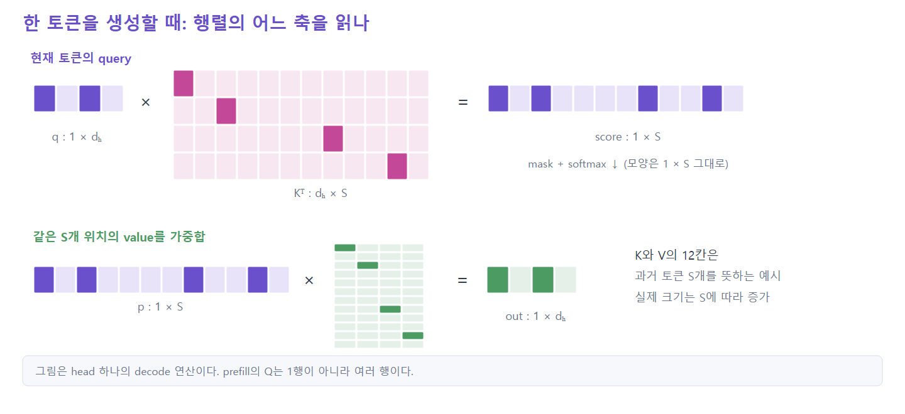
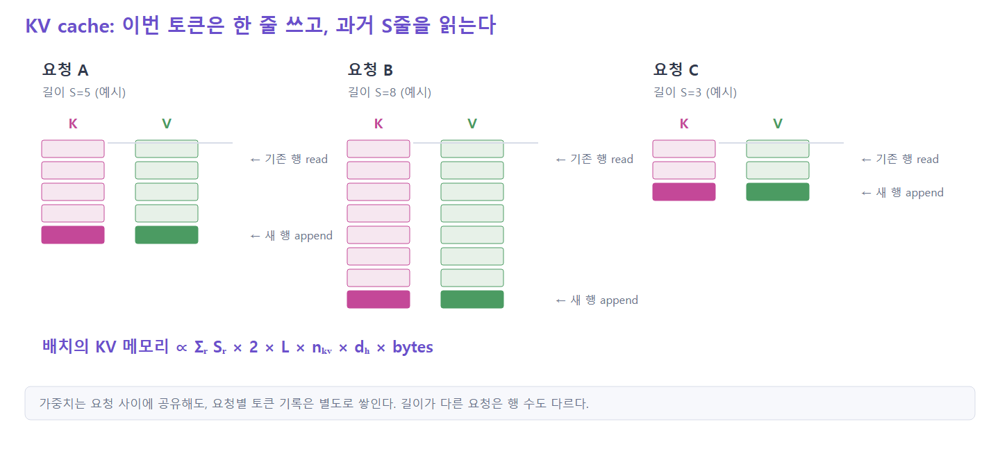
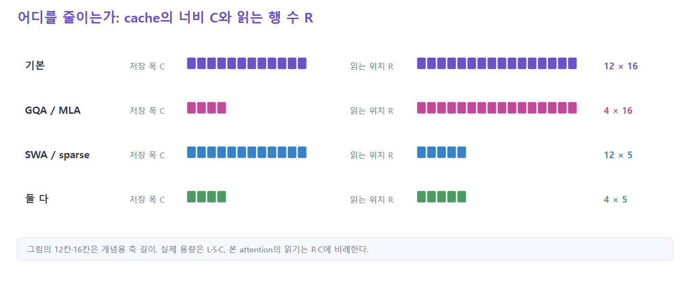
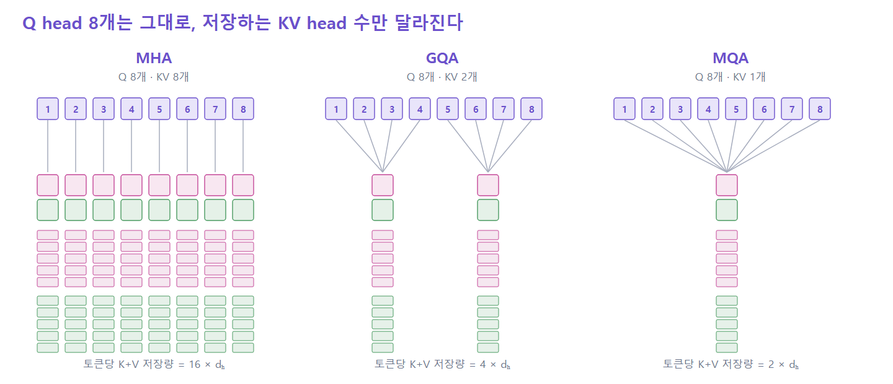
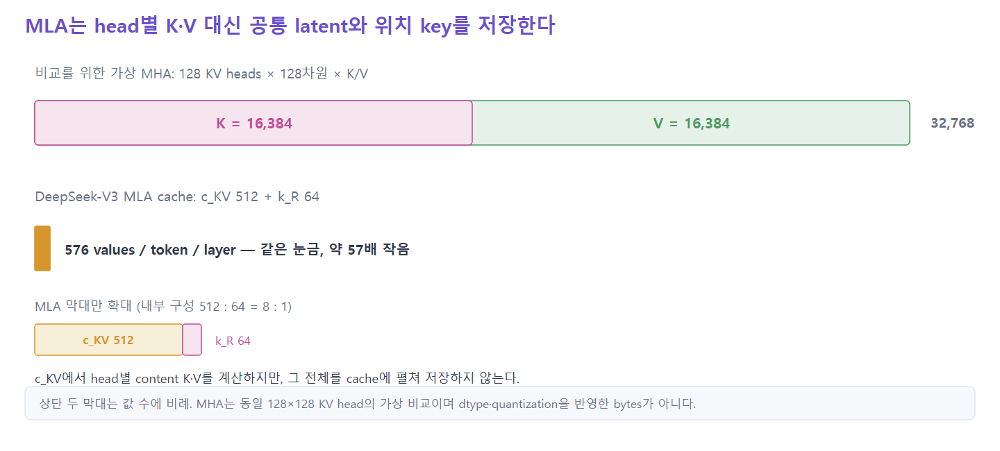
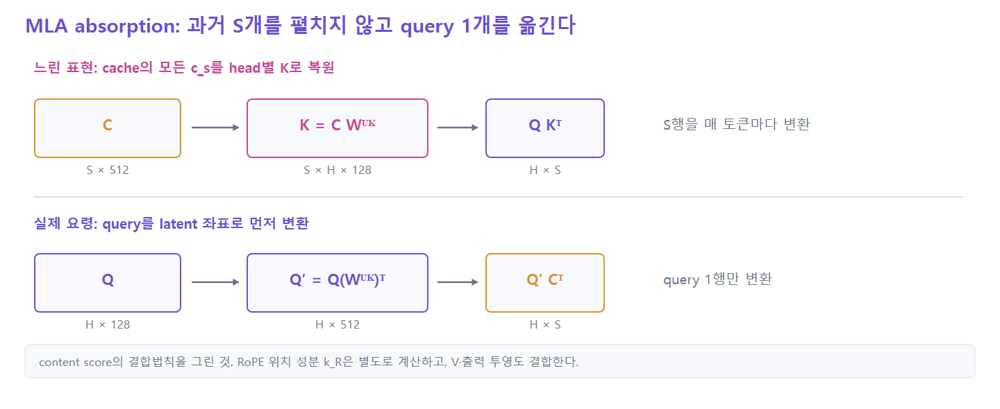
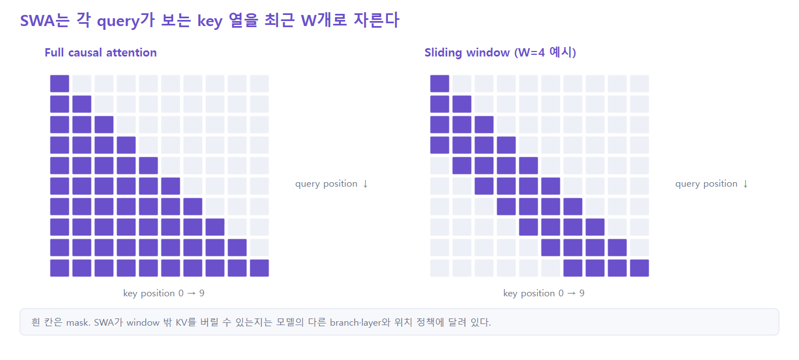
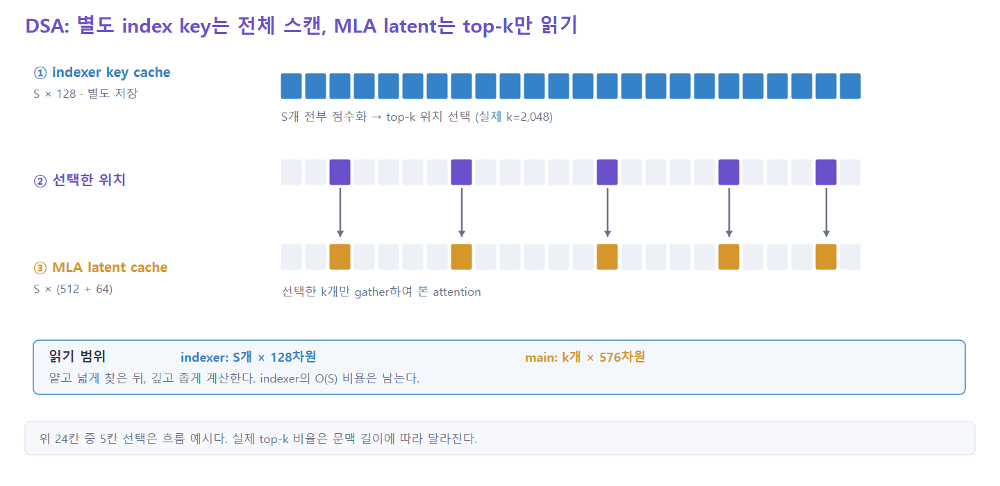
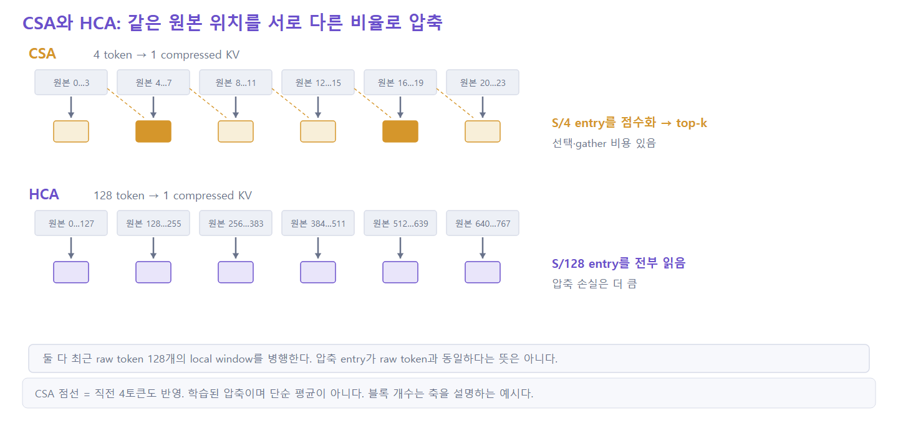
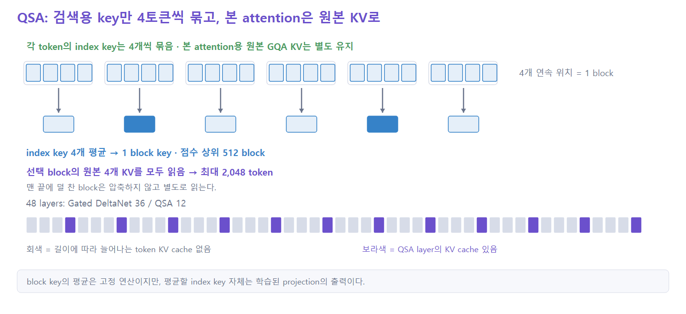

# Attention — KV cache를 어떻게 줄일 것인가

> **오늘의 질문**  
> 한 토큰을 생성할 때, KV cache에서 **무엇을 얼마나 저장하고 무엇을 얼마나 읽는가?**

이 페이지는 decode 시점의 attention을 기준으로 MHA에서 MLA, DSA, CSA/HCA, QSA까지
이어지는 흐름을 따라간다.

> 그림의 셀 개수는 연산의 **축과 접근 패턴**을 보여주기 위한 예시다. 실제 차원·top-k는 각 그림의 shape와 본문 설정값으로 읽는다.

---

## 1. Attention 한 스텝

### 부드러운 검색

- `q`: 지금 찾고 싶은 정보
- `K`: 과거 토큰들이 내건 색인
- `V`: 선택됐을 때 가져올 실제 내용
- `q @ Kᵀ`로 고르고, `p @ V`로 내용을 섞는다



```text
q_t                 (1 × d_h)
K, V                (S × d_h)

score = q_t @ Kᵀ    (1 × S)
out   = softmax(score) @ V
                     (1 × d_h)
```

> **핵심**: 입력도 한 줄, 출력도 한 줄이지만 중간에서 K와 V의 `S`줄을 읽는다.

`prefill`과 `decode`는 구분해야 한다.

| | query 수 | attention 비용의 길이 축 |
|---|---:|---:|
| Prefill | `S` | 전체 query × 전체 key → `O(S²)` |
| Decode 한 스텝 | `1` | query 하나 × 과거 key → `O(S)` |

이번 발표는 두 번째, 즉 **KV cache를 반복해서 읽는 decode**에 초점을 둔다.

---

## 2. KV cache가 문제인 이유



```text
KV cache per request
  = 2 × L × S × n_kv × d_h × bytes
    └K,V┘
```

문제는 두 가지다.

1. **context 길이에 비례한다.** `S`가 길어질수록 저장량과 decode 읽기량이 커진다.
2. **요청마다 내용이 다르다.** 가중치는 공유하지만 사용자의 대화 기록은 공유할 수 없다.

연산도 두 경로로 나눠 볼 수 있다.

| | Write | Read |
|---|---|---|
| 하는 일 | 현재 토큰의 `k_t`, `v_t` 한 줄을 append | 점수에서 K, 가중합에서 V를 읽음 |
| 범위 | 한 줄 | 과거 `S`줄 |
| 주로 줄이는 계열 | Compressed | Sparse |

> 실제 serving 메모리는 단순한 batch 숫자보다 **동시에 살아 있는 요청의 전체 token 수**에
> 가깝게 증가한다.

---

## 3. 큰 그림 — 줄이는 축은 세 개



```text
KV cache = [layer, position, stored width]
              L       S         C

저장량       ≈ L × S × C
비싼 읽기량  ≈ L × R × C
```

- `C`: 토큰 하나를 얼마나 얇게 저장하는가
- `R`: 비싼 attention이 실제로 몇 position을 읽는가
- `L`: 몇 layer가 별도 cache를 갖는가

오늘은 `C`와 `R`을 따라간다. Layer Sharing은 다른 두 방법과 조합할 수 있는 별도 축으로만
기억한다.

```text
C를 줄이기: MHA → MQA → GQA → MLA
R을 줄이기: Full → SWA → DSA → CSA/HCA → QSA
```

---

## 4. MHA → MQA → GQA

한 head는 하나의 softmax 분포를 만든다. 서로 다른 관계를 동시에 찾기 위해 query head는
여러 개가 필요하다.

그런데 query의 관점이 여러 개 필요하다고 해서 **K와 V까지 모두 달라야 할까?**



| 방식 | Query heads | KV heads | Cache 폭 |
|---|---:|---:|---:|
| MHA | `n_h` | `n_h` | 기준 |
| MQA | `n_h` | `1` | MHA의 `1/n_h` |
| GQA | `n_h` | `n_kv` | MHA의 `n_kv/n_h` |

- **MQA**: 모든 query head가 K·V 하나를 공유한다.
- **GQA**: query head를 그룹으로 묶어 그룹마다 K·V 하나를 둔다.
- query head 수와 attention 출력 수는 유지되지만 KV projection·저장량·메모리 읽기는 줄어든다.

> GQA는 KV head의 **개수**를 줄였다. 그런데 개수는 1보다 작아질 수 없다.

---

## 5. MLA — 저장하는 값 자체를 바꾼다

*Multi-head Latent Attention*

### 5.1 K와 V 대신 공동 latent를 저장



DeepSeek-V3 설정 기준:

```text
MHA 가정 : K + V = 2 × 128 heads × 128 = 32,768 values
MLA      : c_KV 512 + k_R 64              =    576 values
```

MLA는 입력 `x_t`에서 K와 V를 바로 만들지 않는다.

```text
x_t ── down projection ──► c_KV
                              ├──► head별 content key
                              └──► head별 value

cache에는 c_KV와 공유 RoPE key k_R만 저장
```

`k_R`은 위치별 RoPE가 projection 사이에 끼어 absorption을 막기 때문에 따로 저장하는
작은 위치 key 조각이다.

### 5.2 압축했다가 매번 펴면 이득이 사라진다



```text
q · (c W^UK)ᵀ = (q W^UKᵀ) · cᵀ
```

같은 점수를 두 방식으로 계산할 수 있다.

- Naive: cache의 latent `S`개를 head별 K·V로 복원한다.
- Absorption: 현재 query `1`개를 latent 좌표계로 옮긴다.

V 쪽도 같은 결합법칙으로 latent에서 먼저 가중합한 뒤 output projection과 묶는다.

### 5.3 MLA가 치른 값

- 저장 폭 `C`는 크게 줄어든다.
- 읽는 위치 `R`은 여전히 `S`다.
- latent 공간의 내적과 query/output projection 계산은 더 무거워진다.
- 효율을 얻으려면 MLA에 맞춘 kernel이 필요하다.

> **메모리 읽기를 줄이고 계산을 더 지불하는 거래다.**

---

## 6. SWA — 최근 것만 읽는다

*Sliding Window Attention*



- 각 query는 최근 `W`개 위치만 본다.
- 오래된 KV를 버리면 cache도 `W`에서 상한이 생긴다.
- 읽는 구간이 연속이라 별도의 search·sort·gather가 없다.
- 한 layer에서는 window 밖 token에 직접 접근할 수 없다.
- streaming에서는 처음 몇 token을 sink로 남겨 두기도 한다.

> SWA의 규칙은 싸지만 고정되어 있다. **최근 token이 항상 중요한 것은 아니다.**

---

## 7. DSA — 싸게 찾고, 비싸게 본다

*DeepSeek Sparse Attention*



DSA는 두 경로를 갖는다.

1. **선택 경로**: 별도 indexer K cache의 `S`개를 값싸게 점수화한다.
2. **본 경로**: 선택된 위치의 MLA latent만 gather해 Sparse MLA를 계산한다.

DeepSeek-V3.2 공개 설정:

```text
indexer     : 64 heads × 128 dim
main top-k  : 2,048 tokens
MLA cache   : c_KV 512 + k_R 64
```

주의할 점:

- indexer는 MLA latent를 그대로 점수화하지 않는다.
- 자체 projection으로 만든 128차원 key를 별도 cache에 저장한다.
- 비싼 attention의 범위는 `S → k`지만, 값싼 `O(S)` scan은 남는다.

DSA가 새로 지불하는 비용:

- top-k
- 흩어진 token을 모으는 gather
- MLA cache 외의 indexer key cache

> DSA가 남긴 질문: **indexer가 훑을 후보 자체를 먼저 줄일 수 없을까?**

---

## 8. CSA와 HCA — 압축하고 고르는 두 가지 방식

DeepSeek-V4는 token 축을 먼저 압축한다.



### CSA — 좁고 정밀하게

```text
S raw tokens → 학습 압축 → S/4 compressed KV → indexer → top-1,024
```

- DSA의 lightning indexer를 압축된 KV 엔트리 위에 적용한다.
- 압축 엔트리에는 직전 4토큰도 반영된다. 학습 압축이지 인접 4토큰의 단순 평균이 아니다.
- index scan·top-k·gather는 남지만 후보 수가 먼저 1/4이 된다.

### HCA — 넓고 거칠게

```text
S raw tokens → 학습 압축 → S/128 compressed KV → 전부 dense attention
```

- 압축을 강하게 해 전체 context를 전부 읽는다.
- 선택·정렬·gather가 없다.
- 하나의 compressed entry에 많은 token이 섞이므로 세부 정보는 거칠어진다.

두 방식 모두 최근 raw token `128`개를 보는 local sliding-window branch를 함께 둔다.
모델의 주요 layer에서는 CSA와 HCA가 거의 1:1로 교대한다.

> **정확성 주의**: DeepSeek-V4 core attention은 1개 KV head, `head_dim=512`를 사용한다.
> CSA/HCA를 “MLA 위에 얹은 구조”라고 설명하지 않는다.

---

## 9. QSA — 같은 질문에 도달한 다른 답

*Qwen Sparse Attention*



Qwen3.8-Flash-Next의 QSA:

1. 검색용 indexer key를 연속된 4 token씩 평균해 micro-block key로 만든다.
2. 압축된 block 점수 중 상위 512 block을 고른다.
3. 선택한 block을 원래 token 위치로 펼친다.
4. 본 Sparse GQA는 선택된 block의 **원본 KV**를 읽는다.

맨 끝에 4개 미만으로 남은 block은 압축된 검색 block과 별도로 처리한다.

```text
indexer_compress_ratio = 4
indexer_budget         = 2,048 tokens
선택 block 수           = 2,048 / 4 = 512
```

CSA와의 가장 중요한 차이:

| | CSA | QSA |
|---|---|---|
| 압축 대상 | 본 attention이 읽는 KV | 검색용 index key |
| 선택 결과 | 압축 KV entry | 원본 GQA KV의 연속 block |
| 장점 | 저장과 검색을 함께 줄임 | block 단위 연속 접근 |

모델 전체는 48층 중 Gated DeltaNet 36층과 QSA 12층으로 구성된다. 즉 길이에 비례하는
token-level KV를 모든 층에 두지 않고, 네 층 중 한 층에서만 정밀 검색한다.

---

## 10. 한 장으로 정리

| 기법 | 저장하는 것 | 비싼 읽기 범위 | 새로 치르는 값 |
|---|---|---:|---|
| MHA | head별 K,V | `S` | 기준점 |
| MQA/GQA | 공유된 K,V | `S` | KV 공유에 따른 표현력 절충 |
| MLA | `c_KV + k_R` | `S` | 더 큰 latent 내적·전용 kernel |
| SWA | 최근 `W`의 KV | `W` | 먼 token 직접 접근 불가 |
| DSA | MLA cache + 별도 index K | `k=2,048` | 싼 `S` scan·top-k·gather |
| CSA | `S/4` compressed KV | top-1,024 | 학습 압축·top-k·gather |
| HCA | `S/128` compressed KV | 압축 결과 전체 | 거친 정보 |
| QSA | QSA layer의 GQA KV + `S/4` index | raw KV block 최대 2,048 token | block 선택·GDN hybrid |

### 기억할 세 질문

> 1. 한 token을 얼마나 얇게 저장할까?  
> 2. 저장한 token 중 몇 개를 읽을까?  
> 3. 중요한 위치를 고르는 비용은 어떻게 낼까?

---

## 참고

- [Attention Is All You Need](https://arxiv.org/abs/1706.03762)
- [Fast Transformer Decoding: One Write-Head is All You Need](https://arxiv.org/abs/1911.02150)
- [GQA: Training Generalized Multi-Query Transformer Models](https://arxiv.org/abs/2305.13245)
- [DeepSeek-V2 — MLA](https://arxiv.org/abs/2405.04434)
- [Mistral 7B — Sliding Window Attention](https://arxiv.org/abs/2310.06825)
- [DeepSeek-V3.2-Exp — DSA](https://github.com/deepseek-ai/DeepSeek-V3.2-Exp)
- [DeepSeek-V4 — CSA/HCA](https://arxiv.org/abs/2606.19348)
- [Qwen3.8-Next — QSA](https://arxiv.org/abs/2608.30320)
- [AIBook — 어텐션](https://aibook.euiyun.com/chapters/attention.html) — 시각 표현 참고

